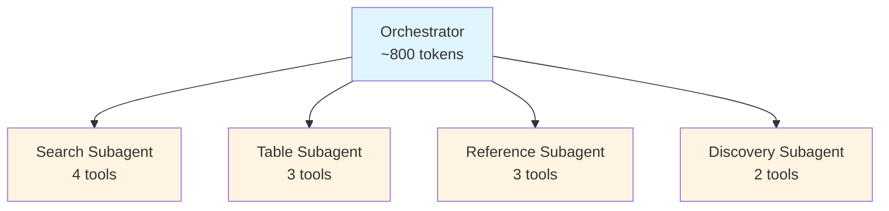
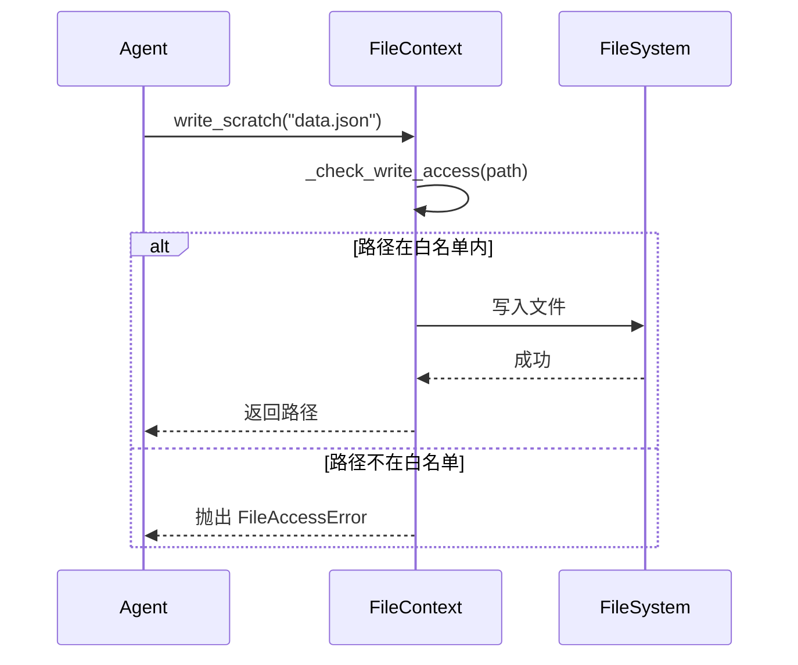
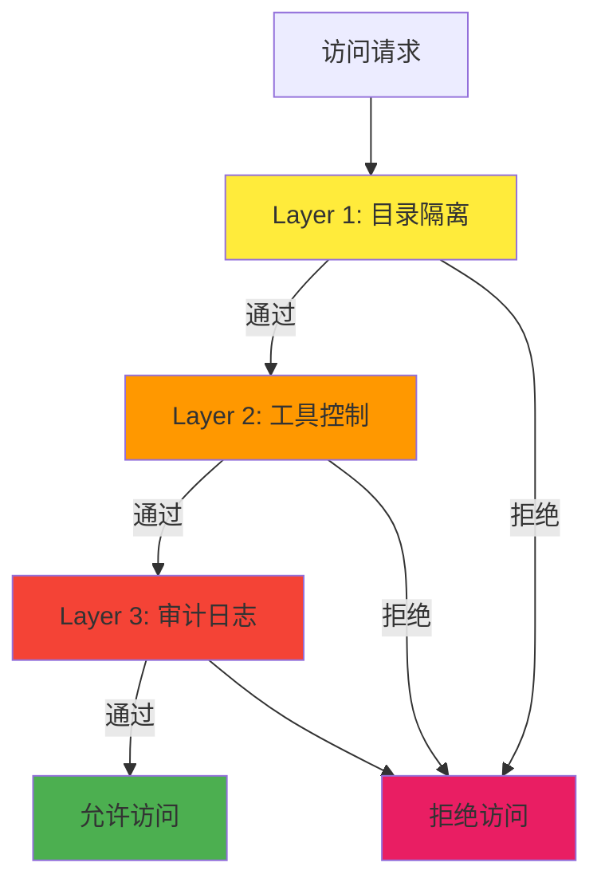
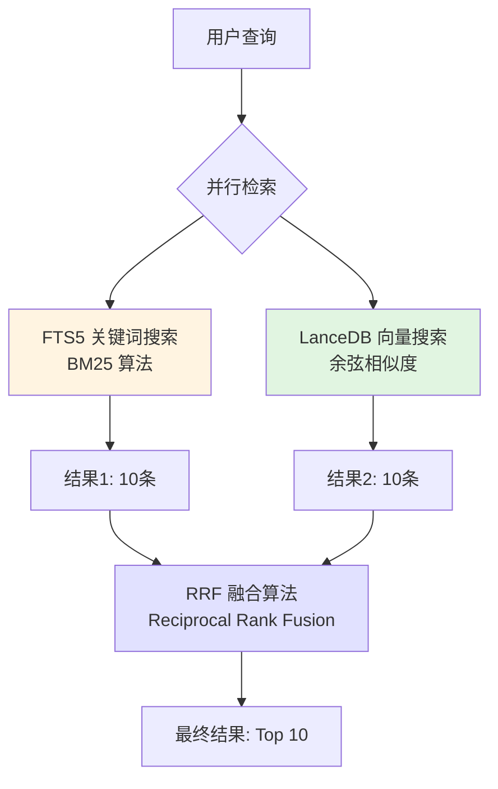

# GridCode-RegReader 架构与设计模式详解

## 目录

1. [系统概览](#系统概览)
2. [核心设计理念](#核心设计理念)
3. [7层架构详解](#7层架构详解)
4. [关键设计模式](#关键设计模式)
5. [核心概念深入](#核心概念深入)
6. [数据流与交互](#数据流与交互)
7. [实战示例](#实战示例)

---

## 系统概览

### RegReader 是什么？

RegReader 是一个**智能电力安规检索系统**，采用创新的 **Page-Based Agentic Search** 架构。与传统的向量检索系统不同，RegReader 让 LLM 像人类一样"翻阅"文档页面，而不是依赖一次性的向量匹配。RegReader基于统一智能体运行时（UAR）框架 GridCode 的插件机制开发及运行。

### 核心创新点

```
传统方案                    RegReader 方案
─────────────────────────────────────────────────
文档 → 分块 → 向量化        文档 → 按页存储
     ↓                           ↓
  一次性检索                 LLM 动态翻阅
     ↓                           ↓
  返回 Top-K                 多轮精准定位
```

**关键差异**：
- **存储单位**：页面（Page）而非任意分块（Chunk）
- **检索方式**：Agent 主动探索，而非被动匹配
- **上下文管理**：通过 Bash+FS 范式实现上下文隔离，从 ~4000 tokens 降至 ~800 tokens

---

## 核心设计理念

### 1. Bash+FS 范式（File System Paradigm）

**核心思想**：将 Agent 间的通信从内存转移到文件系统，实现松耦合和状态持久化。

```
传统 Agent 通信                Bash+FS 范式
─────────────────────────────────────────────────
Agent A → 内存对象 → Agent B   Agent A → 文件 → Agent B
         ↓                              ↓
    紧耦合，难调试                 松耦合，可追溯
```

**类比**：就像 Unix 哲学中的管道（Pipeline），每个 Agent 是一个独立的进程，通过文件系统交换数据。

### 2. 上下文隔离（Context Isolation）

**问题**：传统 Orchestrator 需要在一个上下文中管理所有 Subagent 的工具和提示词，导致上下文膨胀。

**解决方案**：每个 Subagent 拥有独立的工作空间和工具集。



**效果**：
- Orchestrator 只需知道"调用哪个 Subagent"
- 每个 Subagent 专注于自己的领域
- 总上下文从 ~4000 tokens 降至 ~800 tokens

### 3. MCP 协议（Model Context Protocol）

**作用**：统一的工具调用接口，Agent 通过 MCP Server 访问数据，而不是直接操作数据库。

```
Agent Layer (LLM)
      ↓
MCP Protocol (标准接口)
      ↓
MCP Server (FastMCP)
      ↓
Storage Layer (PageStore)
```

**优势**：
- **解耦**：Agent 不依赖具体存储实现
- **可测试**：可以 Mock MCP Server
- **可扩展**：新增工具无需修改 Agent 代码

---

## 7层架构详解

RegReader 采用清晰的分层架构，每层职责明确：

```
┌─────────────────────────────────────────────────────────────────┐
│  Layer 1: Business Layer (CLI / API)                            │
│  职责：用户交互、命令解析                                          │
├─────────────────────────────────────────────────────────────────┤
│  Layer 2: Agent Framework Layer                                 │
│  职责：三种框架实现（Claude SDK / Pydantic AI / LangGraph）       │
├─────────────────────────────────────────────────────────────────┤
│  Layer 3: Orchestrator Layer                                    │
│  职责：查询分析、Subagent 路由、结果聚合                           │
├─────────────────────────────────────────────────────────────────┤
│  Layer 4: Subagents Layer                                       │
│  职责：领域专家（SEARCH / TABLE / REFERENCE / DISCOVERY）         │
├─────────────────────────────────────────────────────────────────┤
│  Layer 5: Infrastructure Layer                                  │
│  职责：文件上下文、技能加载、事件总线、安全防护                      │
├─────────────────────────────────────────────────────────────────┤
│  Layer 6: MCP Tool Layer                                        │
│  职责：16+ 工具，按阶段分类（BASE/MULTI_HOP/CONTEXT/DISCOVERY）    │
├─────────────────────────────────────────────────────────────────┤
│  Layer 7: Storage & Index Layer                                │
│  职责：页面存储、混合检索（FTS5 + LanceDB）                        │
└─────────────────────────────────────────────────────────────────┘
```

### Layer 1: Business Layer

**文件位置**：`src/grid_code/cli.py`

**职责**：
- 解析用户命令（`gridcode search`, `gridcode chat`, etc.）
- 调用 Orchestrator 或直接调用 MCP 工具
- 格式化输出结果

**示例**：
```python
# 用户输入
$ gridcode search "母线失压" -r angui_2024

# CLI 层处理
cli.py → parse_args() → call_orchestrator() → display_results()
```

### Layer 2: Agent Framework Layer

**文件位置**：`src/grid_code/agents/`

**职责**：提供三种 Agent 框架的实现，用户可选择最适合的框架。

**三种实现对比**：

| 框架 | 模式 | 特点 | 适用场景 |
|------|------|------|----------|
| **Claude SDK** | Handoff Pattern | 官方最佳实践，使用 `preset: "claude_code"` | 生产环境，需要稳定性 |
| **Pydantic AI** | Delegation Pattern | 类型安全，`@tool` 装饰器 | 需要强类型约束 |
| **LangGraph** | Subgraph Pattern | 状态机，可视化流程 | 复杂工作流 |

**关键代码**（Claude SDK）：
```python
# agents/claude/orchestrator.py
agent = Agent(
    model="claude-sonnet-4-20250514",
    preset="claude_code",  # 官方最佳实践
    system_prompt=orchestrator_prompt,
    tools=mcp_tools,
)
```

---

### Layer 3: Orchestrator Layer

**文件位置**：`src/grid_code/orchestrator/`

**核心职责**：
- **QueryAnalyzer**：分析查询意图，提取关键提示
- **SubagentRouter**：路由到合适的 Subagent
- **ResultAggregator**：聚合多个 Subagent 的结果
- **Coordinator**：中央协调器，整合上述三者

**工作流程**：


---

### Layer 4: Subagents Layer

**文件位置**：`src/grid_code/subagents/`

**核心概念**：Subagent = 领域专家，每个专注特定任务。

**RegSearch-Subagent 内部结构**：
```
RegSearch-Subagent (领域专家)
├── SearchAgent (4 tools)
│   ├── smart_search
│   ├── read_page_range
│   ├── get_toc
│   └── list_regulations
├── TableAgent (3 tools)
│   ├── search_tables
│   ├── get_table_by_id
│   └── lookup_annotation
├── ReferenceAgent (3 tools)
│   ├── resolve_reference
│   ├── search_annotations
│   └── get_block_with_context
└── DiscoveryAgent (2 tools, optional)
    ├── find_similar_content
    └── compare_sections
```

**为什么需要内部组件？**
- **进一步专业化**：每个内部组件只负责一小部分功能
- **工具隔离**：每个组件只能访问自己的工具，进一步降低上下文
- **独立测试**：可以单独测试每个组件

---

### Layer 5: Infrastructure Layer

**文件位置**：`src/grid_code/infrastructure/`

**核心组件详解**：

#### 5.1 FileContext（文件上下文管理器）

**设计目的**：为每个 Subagent 提供安全的文件系统访问。

**权限模型**：
```python
FileContext(
    subagent_name="regsearch",
    base_dir=Path("subagents/regsearch"),
    can_read=[                        # 可读白名单
        "subagents/regsearch/",       # 自己的目录
        "shared/",                    # 共享资源
    ],
    can_write=[                       # 可写白名单
        "subagents/regsearch/scratch/",  # 临时文件
        "subagents/regsearch/logs/",     # 日志
    ],
)
```

**核心方法**：
```python
# 读取技能说明
skill_content = context.read_skill()

# 读取临时文件
data = context.read_scratch("temp_results.json")

# 写入临时文件
context.write_scratch("output.md", result)

# 读取共享资源（只读）
template = context.read_shared("templates/output.md")

# 记录日志
context.log("处理完成", level="info")
```

**权限检查流程**：


#### 5.2 SkillLoader（技能加载器）

**设计目的**：动态加载可复用的工作流技能。

**技能来源**：
1. `skills/registry.yaml` - 全局技能注册表
2. `skills/*/SKILL.md` - 独立技能定义
3. `subagents/*/SKILL.md` - Subagent 级技能说明

**SKILL.md 格式示例**：
```markdown
---
name: simple_search
description: 简单的文本搜索技能
required_tools:
  - smart_search
  - read_page_range
subagents:
  - regsearch
version: 1.0.0
tags:
  - search
  - basic
---

# 简单搜索技能

## 功能描述
在指定规程中搜索关键词，返回相关页面内容。

## 使用示例
```python
skill = loader.get_skill("simple_search")
result = await skill.execute({"query": "母线失压", "reg_id": "angui_2024"})
```

## 所需工具
- `smart_search`: 混合检索
- `read_page_range`: 读取页面范围
```

**加载流程**：
```python
loader = SkillLoader(project_root=Path.cwd())

# 加载所有技能
all_skills = loader.load_all()

# 获取指定技能
skill = loader.get_skill("simple_search")

# 按 Subagent 获取
regsearch_skills = loader.get_skills_for_subagent("regsearch")

# 按工具获取
skills_using_search = loader.get_skills_by_tool("smart_search")
```

#### 5.3 EventBus（事件总线）

**设计目的**：组件间解耦通信，支持事件回放和审计。

**14种事件类型**：
```python
class SubagentEvent(str, Enum):
    # 任务生命周期
    TASK_STARTED = "task_started"
    TASK_COMPLETED = "task_completed"
    TASK_FAILED = "task_failed"

    # Agent 通信
    HANDOFF_REQUEST = "handoff_request"      # 请求转交
    HANDOFF_ACCEPTED = "handoff_accepted"    # 接受转交
    HANDOFF_REJECTED = "handoff_rejected"    # 拒绝转交

    # 工具调用
    TOOL_CALL_STARTED = "tool_call_started"
    TOOL_CALL_COMPLETED = "tool_call_completed"
    TOOL_CALL_FAILED = "tool_call_failed"

    # 状态变更
    STATE_CHANGED = "state_changed"
    CONTEXT_UPDATED = "context_updated"

    # 结果产出
    RESULT_READY = "result_ready"
    INTERMEDIATE_RESULT = "intermediate_result"

    # 错误处理
    ERROR_OCCURRED = "error_occurred"
```

**使用示例**：
```python
# 创建事件总线
event_bus = EventBus(log_file=Path("coordinator/logs/events.jsonl"))

# 订阅事件
def on_task_completed(event: Event):
    print(f"任务完成: {event.payload['task_id']}")
    print(f"来源: {event.source} -> {event.target}")

event_bus.subscribe(SubagentEvent.TASK_COMPLETED, on_task_completed)

# 发布事件
event_bus.publish(Event(
    event_type=SubagentEvent.TASK_STARTED,
    source="coordinator",
    target="regsearch",
    payload={
        "task_id": "task_1",
        "query": "母线失压如何处理？",
        "timestamp": datetime.now().isoformat(),
    },
))

# 异步发布
await event_bus.apublish(event)

# 回放事件（用于调试）
events = event_bus.replay_events(
    start_time=datetime(2025, 1, 14, 10, 0, 0),
    event_types=[SubagentEvent.TASK_COMPLETED],
)
```

**持久化格式（JSONL）**：
```json
{"timestamp": "2025-01-14T10:30:15.123456", "event_type": "task_started", "source": "coordinator", "target": "regsearch", "payload": {"task_id": "task_1", "query": "..."}}
{"timestamp": "2025-01-14T10:30:18.456789", "event_type": "tool_call_started", "source": "regsearch", "target": null, "payload": {"tool_name": "smart_search", "args": {...}}}
{"timestamp": "2025-01-14T10:30:20.789012", "event_type": "tool_call_completed", "source": "regsearch", "target": null, "payload": {"tool_name": "smart_search", "result_count": 5}}
{"timestamp": "2025-01-14T10:30:22.012345", "event_type": "task_completed", "source": "regsearch", "target": "coordinator", "payload": {"task_id": "task_1", "success": true}}
```

#### 5.4 SecurityGuard（安全守卫）

**设计目的**：实现瑞士奶酪防御模型（Swiss Cheese Defense Model）。

**三层防御**：


**权限矩阵定义**：
```python
@dataclass
class PermissionMatrix:
    subagent_name: str                    # Subagent 名称
    readable_dirs: list[Path]             # 可读目录
    writable_dirs: list[Path]             # 可写目录
    allowed_tools: list[str]              # 允许的工具（空=全部）
    can_execute_scripts: bool             # 是否可执行脚本
    max_file_size_mb: float               # 文件大小限制
    allowed_extensions: list[str]         # 允许的文件扩展名
    denied_patterns: list[str]            # 禁止的路径模式（正则）
```

**预定义权限**：
```python
# RegSearch: 只能查询，不能执行
PREDEFINED_PERMISSIONS = {
    "regsearch": PermissionMatrix(
        subagent_name="regsearch",
        readable_dirs=["shared/", "coordinator/plan.md", "subagents/regsearch/"],
        writable_dirs=["subagents/regsearch/scratch/", "subagents/regsearch/logs/"],
        allowed_tools=[
            "smart_search", "read_page_range", "get_toc",
            "lookup_annotation", "search_tables", "resolve_reference",
            # ... 16+ MCP tools
        ],
        can_execute_scripts=False,  # 禁止执行脚本
    ),

    # Exec: 可以执行脚本，但工具受限
    "exec": PermissionMatrix(
        subagent_name="exec",
        readable_dirs=["shared/", "subagents/"],
        writable_dirs=["subagents/exec/results/", "subagents/exec/logs/"],
        allowed_tools=[],  # Exec 不使用 MCP 工具
        can_execute_scripts=True,  # 允许执行脚本
    ),

    # Validator: 只读审计，不能修改
    "validator": PermissionMatrix(
        subagent_name="validator",
        readable_dirs=["subagents/"],  # 可读所有结果
        writable_dirs=["subagents/validator/audit.log"],  # 只能写审计日志
        allowed_tools=[],
        can_execute_scripts=False,
    ),
}
```

**使用示例**：
```python
guard = SecurityGuard(project_root=Path.cwd(), strict_mode=True)

# 检查文件访问
try:
    guard.check_file_access(
        subagent="regsearch",
        path=Path("subagents/regsearch/scratch/output.json"),
        operation="write",
    )
    # 允许：在可写白名单内
except SecurityViolationError as e:
    print(f"访问被拒绝: {e}")

# 检查工具访问
try:
    guard.check_tool_access(
        subagent="regsearch",
        tool_name="smart_search",
    )
    # 允许：在工具白名单内
except ToolAccessDeniedError as e:
    print(f"工具被拒绝: {e}")

# 检查脚本执行
try:
    guard.check_script_execution(
        subagent="regsearch",
        script_path=Path("scripts/cleanup.sh"),
    )
    # 拒绝：regsearch 不能执行脚本
except SecurityViolationError as e:
    print(f"执行被拒绝: {e}")

# 查询审计日志
violations = guard.get_violations(
    since=datetime(2025, 1, 14, 0, 0, 0),
    limit=100,
)
for v in violations:
    print(f"[{v.timestamp}] {v.subagent} 尝试 {v.action} {v.resource} - 被拒绝")
```

**审计日志格式（JSONL）**：
```json
{"timestamp": "2025-01-14T10:30:15.123456", "subagent": "regsearch", "action": "file_access", "resource": "subagents/exec/secret.txt", "operation": "read", "allowed": false, "details": {"reason": "Path not in allowed read directories"}}
{"timestamp": "2025-01-14T10:30:16.456789", "subagent": "regsearch", "action": "tool_access", "resource": "execute_command", "operation": "tool_access", "allowed": false, "details": {"reason": "Tool not in allowed list"}}
{"timestamp": "2025-01-14T10:30:17.789012", "subagent": "regsearch", "action": "file_access", "resource": "subagents/regsearch/scratch/output.json", "operation": "write", "allowed": true, "details": {}}
```

---

### Layer 6: MCP Tool Layer

**文件位置**：`src/grid_code/mcp/`

**设计原则**：
1. **工具原子化**：每个工具只做一件事
2. **幂等性**：多次调用同一工具，结果一致
3. **无状态**：工具不保存状态，所有信息通过参数传递
4. **标准返回**：所有工具返回统一的 JSON 格式

**工具分类（按阶段）**：

| 阶段 | 工具数量 | 典型工具 | 使用场景 |
|------|----------|----------|----------|
| **BASE** | 4 | `smart_search`, `read_page_range`, `get_toc` | 基础检索和导航 |
| **MULTI_HOP** | 3 | `lookup_annotation`, `search_tables`, `resolve_reference` | 跨页引用解析 |
| **CONTEXT** | 3 | `search_annotations`, `get_table_by_id`, `get_block_with_context` | 上下文扩展 |
| **DISCOVERY** | 2 | `find_similar_content`, `compare_sections` | 语义探索（可选） |
| **NAVIGATION** | 3 | `get_tool_guide`, `get_chapter_structure`, `read_chapter_content` | 结构导航 |

**工具调用示例**：
```python
# 1. BASE 阶段：基础检索
result = await mcp_client.call_tool("smart_search", {
    "query": "母线失压",
    "reg_id": "angui_2024",
    "chapter_scope": "第六章",
    "limit": 10,
})
# 返回：[{"page_num": 12, "score": 0.95, "content": "...", "source": "angui_2024:12"}, ...]

# 2. MULTI_HOP 阶段：跨页引用
annotation = await mcp_client.call_tool("lookup_annotation", {
    "reg_id": "angui_2024",
    "annotation_id": "注1",
    "page_hint": 45,
})
# 返回：{"annotation_id": "注1", "content": "备用电源应在10秒内投入", "source": "angui_2024:46"}

# 3. CONTEXT 阶段：上下文扩展
block = await mcp_client.call_tool("get_block_with_context", {
    "reg_id": "angui_2024",
    "block_id": "block_123",
    "before": 2,  # 前2个块
    "after": 2,   # 后2个块
})
# 返回：{"target_block": {...}, "before_blocks": [...], "after_blocks": [...]}

# 4. DISCOVERY 阶段：语义探索
similar = await mcp_client.call_tool("find_similar_content", {
    "reg_id": "angui_2024",
    "query": "故障处理流程",
    "limit": 5,
})
# 返回：[{"content": "...", "score": 0.88, "source": "angui_2024:67"}, ...]
```

---

### Layer 7: Storage & Index Layer

**文件位置**：`src/grid_code/storage/` 和 `src/grid_code/index/`

**核心设计**：
- **存储单位**：Page（页面），而非 Chunk（分块）
- **混合检索**：FTS5（关键词）+ LanceDB（向量）
- **可插拔架构**：支持多种索引后端

**存储模型**：
```python
@dataclass
class PageDocument:
    """单页文档（存储基本单位）"""
    page_num: int                           # 页码
    reg_id: str                             # 规程标识
    content_blocks: list[ContentBlock]      # 内容块列表
    tables: list[TableMeta]                 # 表格元数据
    annotations: list[Annotation]           # 注释列表
    metadata: dict[str, Any]                # 页面元数据

@dataclass
class ContentBlock:
    """内容块"""
    block_id: str                           # 唯一标识
    block_type: str                         # 类型（text/table/heading/list）
    content: str                            # 文本内容
    bbox: tuple[float, float, float, float] | None  # 边界框
    continues_to_next: bool                 # 是否延续到下一页
```

**混合检索流程**：


**可插拔索引后端**：
```python
# 关键词索引（3选1）
KEYWORD_BACKENDS = {
    "fts5": FTS5KeywordIndex,      # SQLite 内置，默认
    "tantivy": TantivyKeywordIndex,  # Rust 实现，高性能
    "whoosh": WhooshKeywordIndex,    # 纯 Python，易调试
}

# 向量索引（2选1）
VECTOR_BACKENDS = {
    "lancedb": LanceDBVectorIndex,   # Arrow 列存储，默认
    "qdrant": QdrantVectorIndex,     # 独立服务，可横向扩展
}

# 使用示例
hybrid_search = HybridSearch(
    keyword_backend="fts5",
    vector_backend="lancedb",
    fts_weight=0.4,    # 关键词权重
    vector_weight=0.6,  # 向量权重
)

results = await hybrid_search.search(
    query="母线失压处理方法",
    reg_id="angui_2024",
    top_k=10,
)
```
