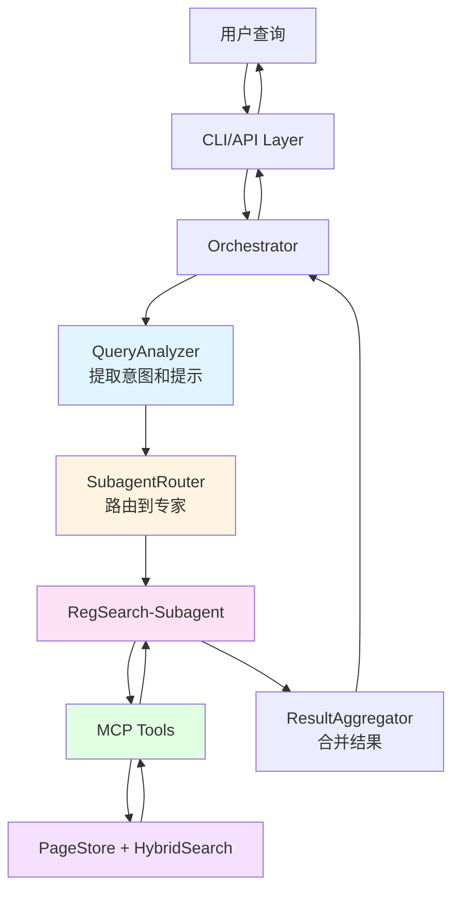

# RegReader 架构详解 - Part 1: 架构概览与设计哲学

## 目录

- [1. 架构概览](#1-架构概览)
- [2. 设计哲学](#2-设计哲学)
- [3. 核心创新](#3-核心创新)
- [4. 架构演进历程](#4-架构演进历程)

---

## 1. 架构概览

### 1.1 什么是 RegReader？

RegReader 是一个**智能电力系统安全规程检索代理**，采用创新的 **Page-Based Agentic Search** 架构。与传统的"一次性向量匹配"不同，RegReader 让 LLM 像人类一样"翻阅"文档页面，动态导航和推理。

**核心特点**：
- 📄 **页面级存储**：文档按页存储，而非任意切块
- 🤖 **智能导航**：LLM 动态"翻页"，而非一次性检索
- 🏗️ **分层架构**：7层清晰分离，职责明确
- 🔧 **多框架支持**：Claude SDK / Pydantic AI / LangGraph 三种实现
- 📁 **Bash+FS 范式**：文件系统作为 Agent 间通信媒介

### 1.2 七层架构全景

```
┌─────────────────────────────────────────────────────────────────┐
│                  Layer 7: Business Layer (CLI / API)             │
│                     用户交互入口                                   │
├─────────────────────────────────────────────────────────────────┤
│                  Layer 6: Agent Framework Layer                  │
│           Claude SDK  |  Pydantic AI  |  LangGraph               │
│                     三种框架实现                                   │
├─────────────────────────────────────────────────────────────────┤
│                  Layer 5: Orchestrator Layer                     │
│   QueryAnalyzer → SubagentRouter → ResultAggregator             │
│                     编排协调层                                     │
├─────────────────────────────────────────────────────────────────┤
│                  Layer 4: Subagents Layer (Domain Experts)       │
│   RegSearch-Subagent (SEARCH/TABLE/REFERENCE/DISCOVERY)         │
│                     领域专家子代理                                 │
├─────────────────────────────────────────────────────────────────┤
│                  Layer 3: Infrastructure Layer                   │
│   FileContext | SkillLoader | EventBus | SecurityGuard          │
│                     基础设施层                                     │
├─────────────────────────────────────────────────────────────────┤
│                  Layer 2: MCP Tool Layer                         │
│   16+ tools organized by phase (BASE/MULTI_HOP/CONTEXT/...)     │
│                     工具协议层                                     │
├─────────────────────────────────────────────────────────────────┤
│                  Layer 1: Storage & Index Layer                  │
│   PageStore | HybridSearch | FTS5/LanceDB | Embedding           │
│                     存储与索引层                                   │
└─────────────────────────────────────────────────────────────────┘
```

### 1.3 关键数据流



---

## 2. 设计哲学

### 2.1 核心原则

#### 原则 1: 页面是第一公民
**Why?** 文档的自然单位是页面，而非任意切块。

```python
# ❌ 传统方式：任意切块
chunks = [
    "母线失压时应立即...",  # 从哪来？不知道
    "检查保护装置..."      # 上下文丢失
]

# ✅ RegReader 方式：页面级存储
page = PageDocument(
    reg_id="angui_2024",
    page_num=45,
    chapter_path=["第六章", "母线故障处置"],
    content_blocks=[...],  # 结构化块
    annotations=[...],      # 页面注释
    active_chapters=[...]   # 活跃章节
)
```

**优势**：
- ✅ 保留完整上下文
- ✅ 支持跨页表格自动拼接
- ✅ 章节信息完整
- ✅ 注释关联清晰

#### 原则 2: LLM 动态导航，而非一次性检索
**Why?** 复杂查询需要多步推理，一次性检索无法满足。

```python
# ❌ 传统方式：一次性向量匹配
results = vector_search("母线失压处理方法", top_k=10)
# 问题：可能遗漏关键信息，无法处理多跳引用

# ✅ RegReader 方式：动态导航
# Step 1: 搜索主题
results = smart_search("母线失压")
# Step 2: 查看目录定位章节
toc = get_toc(reg_id, expand_section="6.2")
# Step 3: 读取章节内容
content = read_chapter_content(reg_id, "6.2.1")
# Step 4: 解析交叉引用
ref = resolve_reference(reg_id, "见表6-2")
# Step 5: 查找注释
annotation = lookup_annotation(reg_id, "注1")
```

**优势**：
- ✅ 支持多跳推理
- ✅ 处理交叉引用
- ✅ 动态调整策略
- ✅ 更接近人类阅读方式

#### 原则 3: 分层架构，职责分离
**Why?** 复杂系统需要清晰的边界和职责划分。

```python
# 每层只关注自己的职责
Storage Layer:    "我只负责存储和读取页面"
MCP Tool Layer:   "我只负责提供工具接口"
Infrastructure:   "我只负责文件管理和事件通信"
Subagents:        "我只负责特定领域的检索"
Orchestrator:     "我只负责协调和路由"
Framework:        "我只负责 LLM 交互"
Business:         "我只负责用户接口"
```

#### 原则 4: 上下文隔离，降低复杂度
**Why?** 单个 Agent 处理所有任务会导致上下文爆炸。

```
传统单 Agent 模式：
┌─────────────────────────────────────┐
│  Main Agent (4000+ tokens context)  │
│  - 所有工具说明                       │
│  - 所有检索逻辑                       │
│  - 所有结果处理                       │
└─────────────────────────────────────┘
问题：上下文过大，推理效率低

RegReader Orchestrator 模式：
┌──────────────────────────────────────┐
│  Orchestrator (800 tokens context)   │
│  - 只负责路由决策                     │
└──────────────────────────────────────┘
         ↓ 委托给专家
┌──────────────────────────────────────┐
│  RegSearch-Subagent (1200 tokens)    │
│  - 只负责检索相关工具                 │
└──────────────────────────────────────┘
优势：上下文减少 75%，推理更聚焦
```

### 2.2 Bash+FS 范式

**核心思想**：文件系统作为 Agent 间的通信媒介。

```
项目结构：
regreader/
├── coordinator/              # 协调器工作区
│   ├── plan.md              # 任务规划（Orchestrator 写入）
│   ├── session_state.json   # 会话状态
│   └── logs/                # 事件日志
│
├── subagents/               # 子代理工作区
│   ├── regsearch/
│   │   ├── SKILL.md         # 技能说明（只读）
│   │   ├── scratch/         # 临时结果（读写）
│   │   └── logs/            # 操作日志（只读）
│   └── ...
│
└── shared/                  # 共享资源（只读）
    ├── data/ → data/storage/  # 符号链接到存储
    ├── docs/                # 工具使用指南
    └── templates/           # 输出模板
```

**通信模式**：

```python
# Orchestrator 写入任务
coordinator.log_query(
    query="母线失压如何处理？",
    hints={"chapter_scope": "第六章"},
    reg_id="angui_2024"
)
# 写入 coordinator/plan.md

# Subagent 读取任务
file_context = FileContext(subagent_name="regsearch")
plan = file_context.get_plan()  # 读取 coordinator/plan.md

# Subagent 写入结果
file_context.write_scratch("result.json", json.dumps(result))

# Orchestrator 读取结果
result = coordinator.read_result("regsearch")
```

**优势**：
- ✅ 松耦合：Agent 间无直接依赖
- ✅ 可观测：所有通信可追踪
- ✅ 可调试：文件内容可直接查看
- ✅ 可扩展：新增 Agent 无需修改现有代码

---

## 3. 核心创新

### 3.1 创新点 1: 页面级存储 + 跨页表格处理

**问题**：电力规程中的表格经常跨页，传统切块方式会破坏表格完整性。

**解决方案**：

```python
# 1. 解析时标记跨页表格
table_meta = TableMeta(
    table_id="table_6_2",
    caption="母线失压处置流程",
    is_truncated=True,  # 标记为跨页
    continues_to_next=True,  # 延续到下一页
    row_count=15,
    col_count=4
)

# 2. 读取时自动拼接
page_content = page_store.load_page_range(
    reg_id="angui_2024",
    start_page=45,
    end_page=47  # 自动检测跨页表格并拼接
)
# 返回完整的合并表格 Markdown
```

### 3.2 创新点 2: 混合检索 (Keyword + Semantic)

**问题**：纯关键词检索召回率低，纯语义检索精确度差。

**解决方案**：RRF (Reciprocal Rank Fusion) 融合

```python
class HybridSearch:
    def search(self, query: str, limit: int = 10):
        # 1. 并行执行两种检索
        keyword_results = self.keyword_index.search(query, limit=limit)
        vector_results = self.vector_index.search(query, limit=limit)

        # 2. RRF 融合
        k = 60  # RRF 参数
        for rank, result in enumerate(keyword_results):
            score_map[result.id] += fts_weight / (k + rank + 1)

        for rank, result in enumerate(vector_results):
            score_map[result.id] += vector_weight / (k + rank + 1)

        # 3. 按融合分数排序
        return sorted(results, key=lambda x: score_map[x.id], reverse=True)
```

**效果**：
- 关键词检索：精确匹配术语（如"母线失压"）
- 语义检索：理解同义表达（如"母线电压丢失"）
- RRF 融合：取两者之长

### 3.3 创新点 3: 可插拔索引后端

**问题**：不同场景需要不同的索引技术。

**解决方案**：抽象基类 + 工厂模式

```python
# 抽象基类
class BaseKeywordIndex(ABC):
    @abstractmethod
    def search(self, query: str, **kwargs) -> list[SearchResult]:
        pass

# 多种实现
class FTS5Index(BaseKeywordIndex):      # SQLite 全文搜索（默认）
class TantivyIndex(BaseKeywordIndex):   # Rust 高性能搜索
class WhooshIndex(BaseKeywordIndex):    # Python 纯实现

# 工厂创建
def create_keyword_index(backend: str):
    if backend == "tantivy":
        return TantivyIndex()
    elif backend == "whoosh":
        return WhooshIndex()
    else:
        return FTS5Index()  # 默认
```

**支持的后端**：

| 组件 | 默认后端 | 可选后端 | 特点 |
|------|---------|---------|------|
| 关键词索引 | FTS5 | Tantivy, Whoosh | FTS5 内置无依赖 |
| 向量索引 | LanceDB | Qdrant | LanceDB 基于 Arrow |
| Embedding | SentenceTransformer | FlagEmbedding | BGE-small-zh-v1.5 |

### 3.4 创新点 4: 三框架统一抽象

**问题**：不同 Agent 框架 API 差异大，难以切换。

**解决方案**：统一抽象层

```python
# 统一的 Orchestrator 基类
class BaseOrchestrator(ABC):
    @abstractmethod
    async def _ensure_initialized(self):
        """框架特定初始化"""
        pass

    @abstractmethod
    async def _execute_orchestration(self, query: str, context: str):
        """框架特定执行逻辑"""
        pass

    # 统一的模板方法
    async def chat(self, message: str) -> AgentResponse:
        await self._ensure_initialized()
        self._reset_tracking()
        hints = self._analyzer.extract_hints_sync(message)
        context = self._build_context_info(hints)
        content = await self._execute_orchestration(message, context)
        return AgentResponse(content=content, sources=self._sources)

# 三种实现
class ClaudeOrchestrator(BaseOrchestrator):     # Handoff Pattern
class PydanticOrchestrator(BaseOrchestrator):   # Delegation Pattern
class LangGraphOrchestrator(BaseOrchestrator):  # Subgraph Pattern
```

**优势**：
- ✅ 统一接口：用户无需关心底层框架
- ✅ 易于切换：修改配置即可切换框架
- ✅ 代码复用：共享基础设施代码

---

## 4. 架构演进历程

### Phase 1: 基础页面存储 (已完成)
- ✅ Docling 文档解析 + OCR
- ✅ 页面级存储 + ContentBlock 模型
- ✅ 跨页表格处理

### Phase 2: 混合检索 (已完成)
- ✅ FTS5 关键词搜索 + LanceDB 向量搜索
- ✅ RRF 结果融合
- ✅ 可插拔索引后端

### Phase 3: MCP 工具层 (已完成)
- ✅ FastMCP 服务器 + 16+ 工具
- ✅ 工具分类：BASE / MULTI_HOP / CONTEXT / DISCOVERY
- ✅ stdio 和 SSE 传输模式

### Phase 4: 多框架 Agent (已完成)
- ✅ Claude Agent SDK 实现
- ✅ Pydantic AI 实现
- ✅ LangGraph 实现

### Phase 5: Subagents 架构 (已完成)
- ✅ 上下文隔离：~4000 tokens → ~800 tokens
- ✅ 4 个专家子代理：SEARCH, TABLE, REFERENCE, DISCOVERY
- ✅ Orchestrator 层：QueryAnalyzer → SubagentRouter → ResultAggregator

### Phase 6: Bash+FS 范式 (当前)
- ✅ Infrastructure 层：FileContext, SkillLoader, EventBus, SecurityGuard
- ✅ RegSearch-Subagent 作为领域专家
- ✅ 文件系统通信
- ✅ Skills 系统

### 未来阶段 (计划中)
- 🔄 Exec-Subagent: 脚本执行 + 沙箱
- 🔄 Validator-Subagent: 结果验证 + 质量保证
- 🔄 多规程推理：跨规程查询支持
- 🔄 流式聚合：实时结果流式返回

---

**下一部分**：[Part 2: 组件详解 (1-4)](#) - 深入讲解 Orchestrator、Subagents、MCP Tools、HybridSearch
