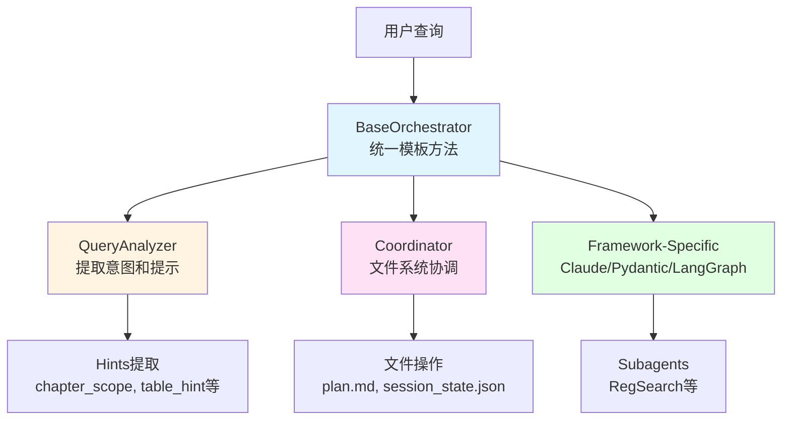

# RegReader 架构详解 - Part 2: Orchestrator Layer 详解

## 目录

- [1. Orchestrator Layer 概述](#1-orchestrator-layer-概述)
- [2. BaseOrchestrator 抽象基类](#2-baseorchestrator-抽象基类)
- [3. Coordinator 协调器](#3-coordinator-协调器)
- [4. QueryAnalyzer 查询分析器](#4-queryanalyzer-查询分析器)

---

## 1. Orchestrator Layer 概述

### 1.1 职责定位

Orchestrator Layer 是 RegReader 的**大脑**，负责：

```
用户查询 → 意图分析 → 路由决策 → 结果聚合 → 返回答案
```

**核心职责**：
1. **查询分析**：提取查询意图和提示信息
2. **路由决策**：决定调用哪些 Subagent
3. **上下文管理**：构建和传递上下文信息
4. **结果聚合**：合并多个 Subagent 的结果
5. **会话管理**：维护对话历史和状态

### 1.2 架构组成



---

## 2. BaseOrchestrator 抽象基类

### 2.1 设计模式：模板方法

**核心思想**：定义统一的执行流程，框架特定部分由子类实现。

```python
class BaseOrchestrator(BaseRegReaderAgent, ABC):
    """Orchestrator 抽象基类

    提供三个框架共享的基础设施：
    - 上下文构建
    - 来源提取
    - 事件处理
    - 生命周期管理
    """

    def __init__(
        self,
        reg_id: str | None = None,
        use_coordinator: bool = False,
        callback: StatusCallback | None = None,
    ):
        super().__init__(reg_id)
        self.use_coordinator = use_coordinator
        self.callback = callback or NullCallback()
        self._initialized = False
        self._sources: list[str] = []
        self._tool_calls: list[dict] = []

        # QueryAnalyzer（用于提取查询提示）
        self._analyzer = QueryAnalyzer()

        # Coordinator（如果启用）
        self.coordinator: Coordinator | None = None
        if use_coordinator:
            self.coordinator = Coordinator()
```

### 2.2 统一的 chat 流程（模板方法）

```python
async def chat(self, message: str) -> AgentResponse:
    """统一的 chat 流程

    定义了所有 Orchestrator 的标准执行流程：
    1. 确保初始化
    2. 重置跟踪
    3. 提取提示
    4. 记录查询（如果使用 Coordinator）
    5. 构建上下文
    6. 发送思考事件
    7. 执行编排（框架特定）
    8. 发送完成事件
    9. 写入结果（如果使用 Coordinator）
    10. 返回响应
    """
    # 1. 确保初始化
    await self._ensure_initialized()

    # 2. 重置跟踪
    self._reset_tracking()

    # 3. 提取提示
    hints = self._analyzer.extract_hints_sync(message)
    logger.debug(f"Extracted hints: {hints}")

    # 4. 记录查询（如果使用 Coordinator）
    if self.use_coordinator and self.coordinator:
        await self.coordinator.log_query(message, hints, self.reg_id)

    # 5. 构建上下文
    context_info = self._build_context_info(hints)

    # 6. 发送思考事件
    await self._send_event(thinking_event("正在分析查询..."))

    # 7. 执行编排（框架特定）
    try:
        content = await self._execute_orchestration(message, context_info)
    except Exception as e:
        logger.error(f"Orchestration failed: {e}")
        raise

    # 8. 发送完成事件
    await self._send_event(response_complete_event())

    # 9. 写入结果（如果使用 Coordinator）
    if self.use_coordinator and self.coordinator:
        await self.coordinator.write_result(content, self._sources, self._tool_calls)

    # 10. 返回响应
    return AgentResponse(
        content=content,
        sources=self._sources,
        tool_calls=self._tool_calls,
    )
```

### 2.3 共享方法实现

#### 2.3.1 上下文构建

```python
def _build_context_info(self, hints: dict[str, Any]) -> str:
    """构建上下文信息

    将 reg_id 和 hints 格式化为上下文字符串。
    """
    context_parts = []

    if self.reg_id:
        context_parts.append(f"默认规程: {self.reg_id}")

    if hints:
        hints_lines = [f"- {k}: {v}" for k, v in hints.items() if v]
        if hints_lines:
            context_parts.append("查询提示:\n" + "\n".join(hints_lines))

    return "\n\n".join(context_parts) if context_parts else ""
```

**示例输出**：
```
默认规程: angui_2024

查询提示:
- chapter_scope: 第六章
- table_hint: 表6-2
- annotation_hint: 注1
```

#### 2.3.2 来源提取

```python
def _extract_sources(self, result: Any) -> None:
    """递归提取来源引用

    从工具调用结果中提取所有 source 字段。
    """
    if isinstance(result, dict):
        # 提取 source 字段
        if "source" in result:
            source = result["source"]
            if source and source not in self._sources:
                self._sources.append(source)

        # 递归处理所有值
        for value in result.values():
            self._extract_sources(value)

    elif isinstance(result, list):
        # 递归处理列表元素
        for item in result:
            self._extract_sources(item)

    elif isinstance(result, str):
        # 尝试解析 JSON 字符串
        try:
            parsed = json.loads(result)
            self._extract_sources(parsed)
        except (json.JSONDecodeError, TypeError):
            pass
```

**示例**：
```python
# 工具返回结果
result = {
    "content": "母线失压处理流程...",
    "source": "angui_2024 P45",
    "related": [
        {"source": "angui_2024 P46"},
        {"source": "angui_2024 表6-2"}
    ]
}

# 提取后
self._sources = [
    "angui_2024 P45",
    "angui_2024 P46",
    "angui_2024 表6-2"
]
```

### 2.4 抽象方法（子类实现）

```python
@abstractmethod
async def _ensure_initialized(self) -> None:
    """初始化组件（框架特定）

    子类需要实现此方法来初始化框架特定的组件：
    - Claude SDK: 创建 Agent 和 Subagent 定义
    - Pydantic AI: 创建 Agent 并注册工具
    - LangGraph: 构建 Graph 和 Subgraph
    """
    pass

@abstractmethod
async def _execute_orchestration(
    self,
    query: str,
    context_info: str,
) -> str:
    """执行编排逻辑（框架特定）

    子类需要实现此方法来执行框架特定的编排逻辑：
    - Claude SDK: 使用 Handoff Pattern
    - Pydantic AI: 使用 Delegation Pattern
    - LangGraph: 使用 Subgraph Pattern
    """
    pass
```

### 2.5 上下文隔离效果

**传统单 Agent 模式**：
```python
# 所有工具和逻辑都在一个 Agent 中
main_agent = Agent(
    tools=[
        get_toc, smart_search, read_page_range,
        lookup_annotation, search_tables, resolve_reference,
        search_annotations, get_table_by_id, get_block_with_context,
        find_similar_content, compare_sections, get_tool_guide,
        # ... 16+ 工具
    ],
    instructions="""
    你是一个电力规程检索专家...

    可用工具：
    1. get_toc: 获取目录...
    2. smart_search: 智能搜索...
    ... (4000+ tokens)
    """
)
# 问题：上下文过大，推理效率低
```

**RegReader Orchestrator 模式**：
```python
# Orchestrator 只负责路由
orchestrator = ClaudeOrchestrator(
    instructions="""
    你是查询协调器，负责分析查询并路由到合适的专家。

    可用专家：
    - RegSearch: 文档检索和导航
    - TableExpert: 表格查询
    - ReferenceExpert: 交叉引用解析

    (800 tokens)
    """
)

# RegSearch-Subagent 只关注检索
regsearch_subagent = Agent(
    tools=[
        get_toc, smart_search, read_page_range,
        read_chapter_content, get_page_chapter_info
    ],
    instructions="""
    你是文档检索专家，负责查找和导航规程内容。

    (1200 tokens)
    """
)
```

**效果对比**：

| 指标 | 单 Agent | Orchestrator 模式 |
|------|---------|------------------|
| Orchestrator 上下文 | 4000+ tokens | 800 tokens |
| Subagent 上下文 | N/A | 1200 tokens |
| 总上下文 | 4000+ tokens | 2000 tokens |
| 上下文减少 | - | **50%** |
| 推理聚焦度 | 低 | 高 |

---

## 3. Coordinator 协调器

### 3.1 设计理念

Coordinator 是**简化版协调器**，仅负责文件系统功能和事件记录，**不执行路由或 Subagent 调用**。

**职责**：
1. 记录查询和提示到 `plan.md`
2. 维护会话状态到 `session_state.json`
3. 发布事件到 EventBus
4. **不执行路由或 Subagent 调用**（由 Orchestrator 的 LLM 自主完成）

### 3.2 核心数据结构

```python
@dataclass
class SessionState:
    """会话状态

    持久化到 coordinator/session_state.json
    """
    session_id: str
    """会话唯一标识"""

    started_at: datetime = field(default_factory=datetime.now)
    """会话开始时间"""

    query_count: int = 0
    """查询计数"""

    current_reg_id: str | None = None
    """当前规程标识"""

    last_query: str | None = None
    """最后一次查询"""

    last_hints: dict[str, Any] | None = None
    """最后一次提取的提示"""

    accumulated_sources: list[str] = field(default_factory=list)
    """累积的来源（跨查询）"""
```

### 3.3 核心方法

#### 3.3.1 记录查询

```python
async def log_query(
    self,
    query: str,
    hints: dict[str, Any],
    reg_id: str | None = None,
) -> None:
    """记录查询到 plan.md"""
    logger.info(f"记录查询: {query}")

    # 更新会话状态
    self.session_state.query_count += 1
    self.session_state.last_query = query
    self.session_state.last_hints = hints
    if reg_id:
        self.session_state.current_reg_id = reg_id

    # 写入 plan.md
    if self.uses_file_system:
        self._write_plan(query, hints, reg_id)

    # 发布任务开始事件
    task_id = f"task_{self.session_state.query_count}"
    if self.event_bus:
        self.event_bus.publish(Event(
            event_type=SubagentEvent.TASK_STARTED,
            source="coordinator",
            target="orchestrator",
            payload={
                "task_id": task_id,
                "query": query,
                "reg_id": reg_id,
                "hints": hints,
            },
        ))
```

**生成的 plan.md 示例**：
```markdown
# Query 1

**Time**: 2026-01-18T10:30:00
**Query**: 母线失压如何处理？
**Regulation**: angui_2024

## Extracted Hints

- chapter_scope: 第六章
- table_hint: 表6-2

---
```

#### 3.3.2 记录结果

```python
async def write_result(
    self,
    content: str,
    sources: list[str],
    tool_calls: list[dict],
) -> None:
    """记录结果到 plan.md"""
    logger.info("记录结果")

    # 更新累积来源（保持顺序的去重）
    for source in sources:
        if source not in self.session_state.accumulated_sources:
            self.session_state.accumulated_sources.append(source)

    # 写入结果
    if self.uses_file_system:
        self._append_result(content, sources, tool_calls)

    # 保存会话状态
    if self.uses_file_system:
        self._save_session_state()

    # 发布任务完成事件
    task_id = f"task_{self.session_state.query_count}"
    if self.event_bus:
        self.event_bus.publish(Event(
            event_type=SubagentEvent.TASK_COMPLETED,
            source="coordinator",
            target=None,
            payload={
                "task_id": task_id,
                "source_count": len(sources),
                "tool_call_count": len(tool_calls),
            },
        ))
```

**追加到 plan.md 的内容**：
```markdown
## Result

**Content**:
母线失压时应立即检查保护装置...

**Sources** (3):
- angui_2024 P45
- angui_2024 P46
- angui_2024 表6-2

**Tool Calls** (5):
1. smart_search
2. get_toc
3. read_chapter_content
4. search_tables
5. lookup_annotation

---
```

### 3.4 文件系统模式

```python
@property
def uses_file_system(self) -> bool:
    """是否使用文件系统模式

    启用条件：work_dir 不为 None
    """
    return self.work_dir is not None
```

**两种模式**：

1. **文件系统模式**（`work_dir` 不为 None）：
   - 写入 `plan.md`
   - 保存 `session_state.json`
   - 记录事件日志

2. **内存模式**（`work_dir` 为 None）：
   - 仅在内存中维护状态
   - 不写入文件
   - 适用于测试或临时会话

---

## 4. QueryAnalyzer 查询分析器

### 4.1 职责

QueryAnalyzer 负责从用户查询中提取**结构化提示信息**，帮助 Orchestrator 做出更好的路由决策。

**提取的提示类型**：
- `chapter_scope`: 章节范围（如"第六章"）
- `section_number`: 精确章节号（如"2.1.4.1.6"）
- `table_hint`: 表格提示（如"表6-2"）
- `annotation_hint`: 注释提示（如"注1"、"方案A"）
- `reference_text`: 引用文本（如"见第六章"）
- `requires_multi_hop`: 是否需要多跳推理

### 4.2 提取逻辑示例

```python
class QueryAnalyzer:
    def extract_hints_sync(self, query: str) -> dict[str, Any]:
        """同步提取提示信息"""
        hints = {}

        # 1. 提取章节范围
        chapter_pattern = r"第([一二三四五六七八九十\d]+)章"
        if match := re.search(chapter_pattern, query):
            hints["chapter_scope"] = match.group(0)

        # 2. 提取章节编号
        section_pattern = r"\d+\.\d+(?:\.\d+)*"
        if match := re.search(section_pattern, query):
            hints["section_number"] = match.group(0)

        # 3. 提取表格提示
        table_pattern = r"表\s*\d+[-－]?\d*"
        if match := re.search(table_pattern, query):
            hints["table_hint"] = match.group(0)

        # 4. 提取注释提示
        annotation_pattern = r"(注[0-9①②③④⑤⑥⑦⑧⑨⑩一二三四五六七八九十\d]+|方案[A-Za-z甲乙丙丁])"
        if match := re.search(annotation_pattern, query):
            hints["annotation_hint"] = match.group(0)

        # 5. 检测引用文本
        reference_keywords = ["见", "参见", "详见", "按照", "根据"]
        if any(kw in query for kw in reference_keywords):
            hints["reference_text"] = query

        # 6. 检测多跳需求
        multi_hop_keywords = ["对比", "比较", "关联", "相关", "类似"]
        if any(kw in query for kw in multi_hop_keywords):
            hints["requires_multi_hop"] = True

        return hints
```

### 4.3 提取示例

**示例 1：简单查询**
```python
query = "母线失压如何处理？"
hints = analyzer.extract_hints_sync(query)
# 结果：{}（无特殊提示）
```

**示例 2：带章节范围**
```python
query = "第六章中母线失压如何处理？"
hints = analyzer.extract_hints_sync(query)
# 结果：{"chapter_scope": "第六章"}
```

**示例 3：带表格和注释**
```python
query = "表6-2中的注1是什么意思？"
hints = analyzer.extract_hints_sync(query)
# 结果：{
#     "table_hint": "表6-2",
#     "annotation_hint": "注1"
# }
```

**示例 4：多跳查询**
```python
query = "对比第六章和第七章的母线失压处理流程"
hints = analyzer.extract_hints_sync(query)
# 结果：{
#     "chapter_scope": "第六章",  # 提取第一个
#     "requires_multi_hop": True
# }
```

### 4.4 提示信息的使用

Orchestrator 将提示信息传递给 Subagent：

```python
# 1. Orchestrator 提取提示
hints = self._analyzer.extract_hints_sync(message)

# 2. 构建上下文
context_info = self._build_context_info(hints)

# 3. 传递给 Subagent
content = await self._execute_orchestration(message, context_info)
```

Subagent 可以利用提示信息优化工具调用：

```python
# 如果有 chapter_scope 提示，直接限定搜索范围
if hints.get("chapter_scope"):
    results = smart_search(
        query=query,
        reg_id=reg_id,
        chapter_scope=hints["chapter_scope"]  # 限定章节
    )

# 如果有 table_hint，直接搜索表格
if hints.get("table_hint"):
    table = search_tables(
        query=hints["table_hint"],
        reg_id=reg_id
    )
```

---

**下一部分**：[Part 3: Subagents 和 MCP Tools 详解](#) - 深入讲解 RegSearch-Subagent 和 16+ MCP 工具
