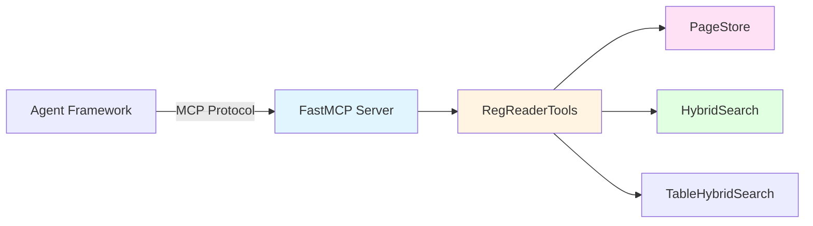
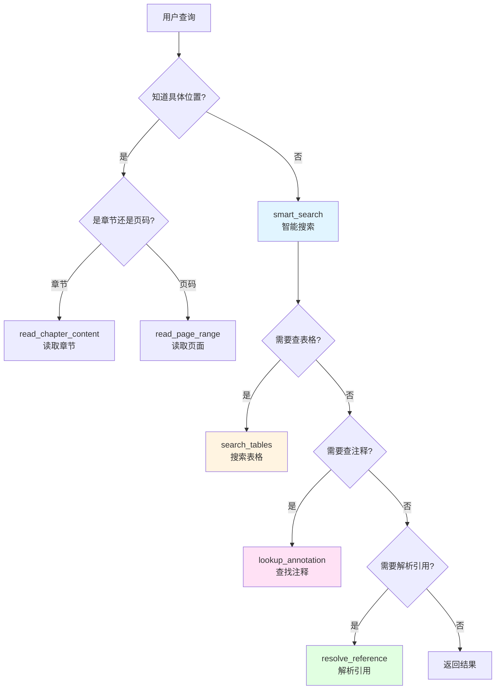

# RegReader 架构详解 - Part 3: MCP Tools Layer 详解

## 目录

- [1. MCP Tools Layer 概述](#1-mcp-tools-layer-概述)
- [2. 工具分类体系](#2-工具分类体系)
- [3. 核心工具详解](#3-核心工具详解)
- [4. 工具设计原则](#4-工具设计原则)

---

## 1. MCP Tools Layer 概述

### 1.1 什么是 MCP？

**MCP (Model Context Protocol)** 是 Anthropic 提出的标准协议，用于 LLM 与外部工具的通信。

**核心概念**：
- **Server**: 提供工具的服务端（RegReader 的 MCP Server）
- **Client**: 调用工具的客户端（Agent Framework）
- **Tool**: 具体的功能接口（如 `smart_search`, `get_toc`）
- **Transport**: 通信方式（stdio 或 SSE）

### 1.2 RegReader 的 MCP 架构



**关键特点**：
- ✅ **协议标准化**：遵循 MCP 规范
- ✅ **传输灵活**：支持 stdio 和 SSE 两种模式
- ✅ **工具丰富**：16+ 工具覆盖所有检索场景
- ✅ **分阶段设计**：BASE → MULTI_HOP → CONTEXT → DISCOVERY

---

## 2. 工具分类体系

### 2.1 四阶段工具分类

RegReader 的工具按使用阶段分为 4 类：

```
Phase 0: BASE (基础工具)
├── get_toc              # 获取目录
├── smart_search         # 智能搜索
└── read_page_range      # 读取页面范围

Phase 1: MULTI_HOP (多跳工具)
├── lookup_annotation    # 查找注释
├── search_tables        # 搜索表格
└── resolve_reference    # 解析引用

Phase 2: CONTEXT (上下文工具)
├── search_annotations   # 搜索所有注释
├── get_table_by_id      # 按ID获取表格
└── get_block_with_context  # 获取块及上下文

Phase 3: DISCOVERY (发现工具)
├── find_similar_content # 查找相似内容
└── compare_sections     # 比较章节

Navigation (导航工具)
├── get_tool_guide       # 获取工具指南
├── get_chapter_structure  # 获取章节结构
├── get_page_chapter_info  # 获取页面章节信息
└── read_chapter_content   # 读取章节内容
```

### 2.2 工具选择决策树



---

## 3. 核心工具详解

### 3.1 Phase 0: 基础工具

#### 3.1.1 get_toc - 获取目录

**功能**：获取规程的目录树结构。

**参数**：
```python
def get_toc(
    reg_id: str,              # 规程标识
    max_depth: int = 3,       # 最大深度（硬性限制为3）
    expand_section: str | None = None  # 完整展开的章节
) -> dict
```

**返回示例**：
```json
{
  "reg_id": "angui_2024",
  "title": "国家电网公司电力安全工作规程",
  "total_pages": 150,
  "items": [
    {
      "title": "1. 总则",
      "level": 1,
      "page_start": 1,
      "page_end": 5,
      "children": [
        {
          "title": "1.1 适用范围",
          "level": 2,
          "page_start": 1,
          "page_end": 2,
          "children": []
        }
      ]
    }
  ]
}
```

**使用场景**：
- 📖 用户想了解规程结构
- 🔍 需要定位特定章节
- 🗺️ 构建导航路径

**设计亮点**：
```python
# 1. 硬性深度限制（防止输出过大）
if max_depth > 3:
    logger.warning(f"max_depth={max_depth} 被强制限制为 3")
    max_depth = 3

# 2. 选择性展开（expand_section 不受深度限制）
if expand_section:
    # 展开指定分支的完整层级
    should_expand = self._is_in_expand_path(item, expand_section)
```

#### 3.1.2 smart_search - 智能搜索

**功能**：混合检索（关键词 + 语义），支持多规程。

**参数**：
```python
def smart_search(
    query: str,                      # 搜索查询
    reg_id: str | list[str] | None,  # 规程ID（支持多种模式）
    chapter_scope: str | None = None,  # 章节范围
    limit: int = 10,                 # 结果数量
    block_types: list[str] | None = None,  # 块类型过滤
    section_number: str | None = None  # 精确章节号
) -> list[dict]
```

**reg_id 的四种模式**：
```python
# 1. 单规程模式
smart_search("母线失压", reg_id="angui_2024")

# 2. 多规程模式
smart_search("母线失压", reg_id=["angui_2024", "wengui_2024"])

# 3. 智能选择模式（根据 query 匹配规程元数据关键词）
smart_search("母线失压", reg_id=None)

# 4. 全规程模式
smart_search("母线失压", reg_id="all")
```

**返回示例**：
```json
[
  {
    "reg_id": "angui_2024",
    "page_num": 45,
    "chapter_path": ["第六章", "母线故障处置"],
    "snippet": "母线失压时应立即检查保护装置...",
    "score": 0.95,
    "source": "angui_2024 P45",
    "block_id": "block_45_3"
  }
]
```

**设计亮点**：
```python
# 1. 智能规程选择
def _smart_select_regulations(self, query: str) -> list[str]:
    """根据查询关键词智能选择规程"""
    regulations = self.page_store.list_regulations()
    matched = []

    for reg in regulations:
        # 匹配 keywords 字段
        for kw in reg.keywords:
            if kw in query:
                matched.append(reg.reg_id)
                break

    # 如果没有匹配，返回所有规程（降级）
    if not matched:
        return [r.reg_id for r in regulations]

    return matched

# 2. 多规程结果合并
for rid in target_reg_ids:
    results = self.hybrid_search.search(query, reg_id=rid, limit=per_reg_limit)
    all_results.extend(results)

# 按分数排序并截取
all_results.sort(key=lambda x: x["score"], reverse=True)
return all_results[:limit]
```

#### 3.1.3 read_page_range - 读取页面范围

**功能**：读取连续页面，自动处理跨页表格拼接。

**参数**：
```python
def read_page_range(
    reg_id: str,
    start_page: int,
    end_page: int
) -> dict
```

**返回示例**：
```json
{
  "content_markdown": "# 第六章 母线故障处置\n\n## 6.1 母线失压\n\n...",
  "source": "angui_2024 P45-47",
  "start_page": 45,
  "end_page": 47,
  "has_merged_tables": true,
  "page_count": 3
}
```

**设计亮点**：
```python
# 1. 限制单次读取页数（防止输出过大）
max_pages = 10
if end_page - start_page + 1 > max_pages:
    end_page = start_page + max_pages - 1

# 2. 自动跨页表格拼接
page_content = self.page_store.load_page_range(reg_id, start_page, end_page)
# PageStore 内部会检测跨页表格并自动合并
```

### 3.2 Phase 1: 多跳工具

#### 3.2.1 lookup_annotation - 查找注释

**功能**：查找并返回指定注释的完整内容。

**参数**：
```python
def lookup_annotation(
    reg_id: str,
    annotation_id: str,      # 注释标识（如"注1", "方案A"）
    page_hint: int | None = None  # 页码提示（优化搜索）
) -> dict
```

**支持的注释变体**：
```python
# 数字变体
"注1" == "注①" == "注一"

# 字母变体
"方案A" == "方案甲"

# 标准化处理
def _normalize_annotation_id(self, annotation_id: str) -> str:
    result = annotation_id.lower()

    # 中文数字转阿拉伯数字
    cn_nums = {"一": "1", "二": "2", ...}
    for cn, num in cn_nums.items():
        result = result.replace(cn, num)

    # 圈数字转普通数字
    circle_nums = {"①": "1", "②": "2", ...}
    for circle, num in circle_nums.items():
        result = result.replace(circle, num)

    return result
```

**返回示例**：
```json
{
  "annotation_id": "注1",
  "content": "母线失压是指母线电压低于额定电压的80%...",
  "page_num": 46,
  "related_blocks": ["block_46_2", "block_46_3"],
  "source": "angui_2024 P46 注1"
}
```

**设计亮点**：
```python
# 页码提示优化搜索顺序
if page_hint:
    # 从 page_hint 向两边扩展搜索
    search_order = self._get_search_order_from_hint(page_hint, total_pages)
    # [45, 44, 46, 43, 47, ...]
else:
    # 顺序搜索
    search_order = list(range(1, total_pages + 1))
```

#### 3.2.2 search_tables - 搜索表格

**功能**：搜索表格（支持精确关键词和模糊语义搜索）。

**参数**：
```python
def search_tables(
    query: str,
    reg_id: str,
    chapter_scope: str | None = None,
    search_mode: Literal["keyword", "semantic", "hybrid"] = "hybrid",
    limit: int = 10
) -> list[dict]
```

**三种搜索模式**：
```python
# 1. keyword: 仅关键词精确匹配（标题和单元格内容）
# 2. semantic: 仅语义相似度搜索
# 3. hybrid: 混合搜索（默认，RRF 融合）
```

**返回示例**：
```json
[
  {
    "table_id": "table_6_2",
    "caption": "母线失压处置流程",
    "reg_id": "angui_2024",
    "page_start": 45,
    "page_end": 47,
    "pages": [45, 46, 47],
    "chapter_path": ["第六章", "母线故障处置"],
    "is_cross_page": true,
    "row_count": 15,
    "col_count": 4,
    "col_headers": ["步骤", "操作", "责任人", "备注"],
    "snippet": "| 步骤 | 操作 | 责任人 | 备注 |\n|------|------|--------|------|\n...",
    "score": 0.92,
    "match_type": "both",
    "source": "angui_2024 P45-47 母线失压处置流程"
  }
]
```

**设计亮点**：
```python
# 1. 优先使用表格索引（O(1) 查找）
if self.table_search.has_index(reg_id):
    results = self.table_search.search(...)
else:
    # 降级：遍历所有页面
    results = self._search_tables_fallback(...)

# 2. 匹配类型优先级
priority = {"caption": 0, "both": 1, "content": 2}
results.sort(key=lambda x: priority.get(x["match_type"], 3))
```

#### 3.2.3 resolve_reference - 解析引用

**功能**：解析并解决交叉引用。

**支持的引用格式**：
```python
# 章节引用
"见第六章", "参见2.1.4", "详见第三节"

# 表格引用
"见表6-2", "参见附表1"

# 条款引用
"见第X条", "按本规程第Y条执行"

# 注释引用
"见注1", "参见方案A"

# 附录引用
"见附录A", "详见附录三"
```

**返回示例**：
```json
{
  "reference_type": "chapter",
  "parsed_target": "第六章",
  "resolved": true,
  "target_location": {
    "section_number": "6",
    "title": "母线故障处置",
    "page_num": 45,
    "node_id": "node_6"
  },
  "preview": "本章规定了母线故障的处置流程...",
  "source": "angui_2024 6 母线故障处置 (P45)"
}
```

**解析流程**：
```python
# 1. 解析引用文本
ref_result = self._parse_reference(reference_text)
# ("chapter", "6")

# 2. 根据类型解析目标
if ref_type == "chapter":
    return self._resolve_chapter_reference(...)
elif ref_type == "table":
    return self._resolve_table_reference(...)
elif ref_type == "annotation":
    return self._resolve_annotation_reference(...)
# ...
```

---

## 4. 工具设计原则

### 4.1 原则 1: 单一职责

每个工具只做一件事，做好一件事。

```python
# ✅ 好的设计
get_toc()           # 只负责获取目录
smart_search()      # 只负责搜索
read_page_range()   # 只负责读取页面

# ❌ 不好的设计
search_and_read()   # 既搜索又读取，职责不清
```

### 4.2 原则 2: 返回结构化数据

所有工具返回结构化的 dict，包含必要的元数据。

```python
# ✅ 结构化返回
{
  "content": "...",
  "source": "angui_2024 P45",  # 必须包含来源
  "page_num": 45,
  "chapter_path": ["第六章"],
  "metadata": {...}
}

# ❌ 纯文本返回
"母线失压时应立即..."  # 缺少来源和上下文
```

### 4.3 原则 3: 支持渐进式查询

工具设计支持从粗到细的渐进式查询。

```python
# 1. 粗粒度：搜索
results = smart_search("母线失压")

# 2. 中粒度：查看目录
toc = get_toc(reg_id, expand_section="6")

# 3. 细粒度：读取章节
content = read_chapter_content(reg_id, "6.2.1")

# 4. 精细粒度：查找注释
annotation = lookup_annotation(reg_id, "注1")
```

### 4.4 原则 4: 防御性设计

工具内部做好参数验证和错误处理。

```python
# 1. 参数验证
if start_page > end_page:
    raise InvalidPageRangeError(start_page, end_page)

# 2. 限制输出大小
max_pages = 10
if end_page - start_page + 1 > max_pages:
    end_page = start_page + max_pages - 1

# 3. 降级处理
if self.table_search.has_index(reg_id):
    results = self.table_search.search(...)
else:
    # 降级：遍历所有页面
    results = self._search_tables_fallback(...)
```

---

**下一部分**：[Part 4: Infrastructure Layer 详解](#) - 深入讲解 FileContext、EventBus、SkillLoader、SecurityGuard
