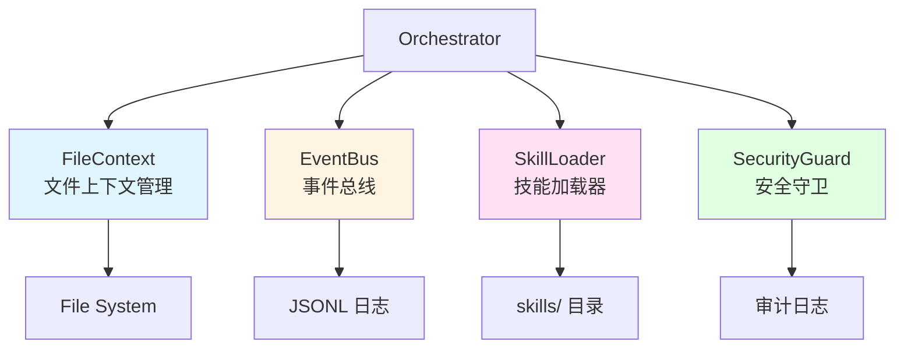
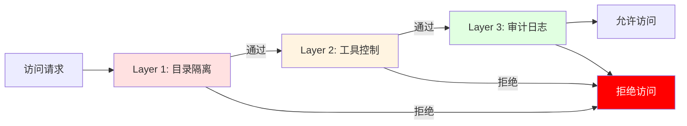
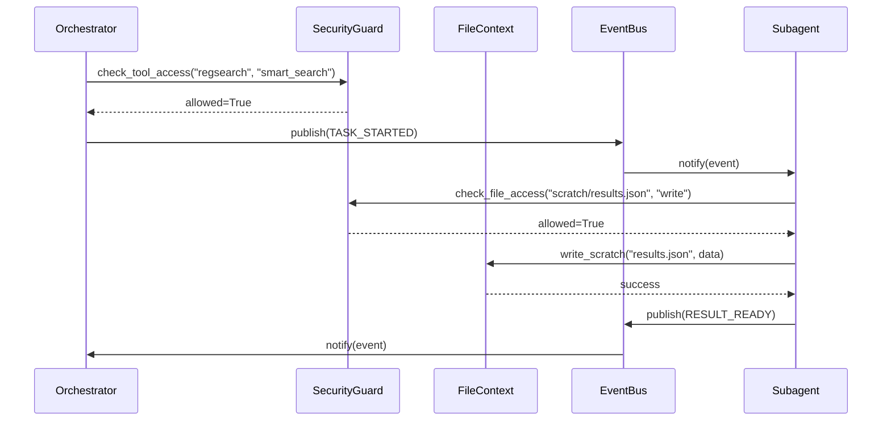

# RegReader 架构详解 - Part 4: Infrastructure Layer 详解

## 目录

- [1. Infrastructure Layer 概述](#1-infrastructure-layer-概述)
- [2. FileContext - 文件上下文管理器](#2-filecontext---文件上下文管理器)
- [3. EventBus - 事件总线](#3-eventbus---事件总线)
- [4. SkillLoader - 技能加载器](#4-skillloader---技能加载器)
- [5. SecurityGuard - 安全守卫](#5-securityguard---安全守卫)

---

## 1. Infrastructure Layer 概述

### 1.1 什么是 Infrastructure Layer？

**Infrastructure Layer（基础设施层）** 是 RegReader 架构的核心支撑层，为 Bash+FS 范式提供基础设施。

**核心职责**：
- 📁 **文件系统管理**：控制 Subagent 的文件访问权限
- 📡 **事件通信**：提供松耦合的 Pub/Sub 事件系统
- 📦 **技能加载**：动态加载和管理可复用技能
- 🔒 **安全控制**：实现瑞士奶酪防御模型

### 1.2 四大核心组件



### 1.3 设计原则

| 原则 | 说明 | 实现 |
|------|------|------|
| **读写隔离** | 明确区分可读和可写目录 | FileContext 的 `can_read` / `can_write` |
| **松耦合通信** | Subagent 之间通过事件通信 | EventBus 的 Pub/Sub 模式 |
| **动态加载** | 技能可热加载，无需重启 | SkillLoader 的 `refresh()` |
| **纵深防御** | 多层安全检查，防止单点失效 | SecurityGuard 的三层防御 |

---

## 2. FileContext - 文件上下文管理器

### 2.1 核心功能

**FileContext** 是 Bash+FS 范式的核心，提供受控的文件系统访问。

**关键特性**：
- ✅ **读写隔离**：明确区分可读和可写目录
- ✅ **工作空间管理**：自动创建 `scratch/` 和 `logs/` 目录
- ✅ **路径验证**：防止路径遍历攻击
- ✅ **同步/异步 API**：支持两种调用方式

### 2.2 目录结构

```
subagents/regsearch/          # Subagent 工作空间
├── SKILL.md                   # 技能说明（只读）
├── scratch/                   # 临时结果（可写）
│   ├── search_results.json
│   └── table_cache.json
└── logs/                      # 日志文件（可写）
    └── regsearch.log

shared/                        # 共享资源（只读）
├── data/ → data/storage/      # 符号链接到存储
├── docs/                      # 工具使用指南
└── templates/                 # 输出模板

coordinator/                   # 协调器工作空间
├── plan.md                    # 任务计划（只读给 Subagent）
└── session_state.json         # 会话状态
```

### 2.3 核心 API

#### 2.3.1 初始化

```python
from regreader.infrastructure.file_context import FileContext

# 创建 FileContext
ctx = FileContext(
    workspace_dir=Path("subagents/regsearch"),
    can_read=[
        Path("shared/"),
        Path("coordinator/plan.md"),
        Path("subagents/regsearch/"),
    ],
    can_write=[
        Path("subagents/regsearch/scratch/"),
        Path("subagents/regsearch/logs/"),
    ],
)
```

**参数说明**：
- `workspace_dir`: Subagent 的工作目录
- `can_read`: 可读目录/文件列表（相对于 `project_root`）
- `can_write`: 可写目录/文件列表（相对于 `project_root`）

#### 2.3.2 读取文件

```python
# 1. 读取技能说明
skill_content = ctx.read_skill()
# 等价于读取 subagents/regsearch/SKILL.md

# 2. 读取临时结果
results = ctx.read_scratch("search_results.json")
# 等价于读取 subagents/regsearch/scratch/search_results.json

# 3. 读取共享资源
guide = ctx.read_shared("docs/tool_guide.md")
# 等价于读取 shared/docs/tool_guide.md

# 4. 读取任意文件（需在 can_read 范围内）
content = ctx.read_file(Path("coordinator/plan.md"))
```

**权限检查**：
```python
# 内部实现
def _check_read_access(self, path: Path) -> bool:
    abs_path = path if path.is_absolute() else self.project_root / path
    for allowed in self.can_read:
        allowed_abs = allowed if allowed.is_absolute() else self.project_root / allowed
        try:
            abs_path.relative_to(allowed_abs)
            return True
        except ValueError:
            continue
    return False
```

#### 2.3.3 写入文件

```python
# 1. 写入临时结果
ctx.write_scratch("search_results.json", json.dumps(results))

# 2. 追加日志
ctx.log("Search completed with 10 results")
# 等价于追加到 subagents/regsearch/logs/regsearch.log

# 3. 写入任意文件（需在 can_write 范围内）
ctx.write_file(
    Path("subagents/regsearch/scratch/cache.json"),
    json.dumps(cache_data)
)
```

**权限检查**：
```python
def _check_write_access(self, path: Path) -> bool:
    abs_path = path if path.is_absolute() else self.project_root / path
    for allowed in self.can_write:
        allowed_abs = allowed if allowed.is_absolute() else self.project_root / allowed
        try:
            abs_path.relative_to(allowed_abs)
            return True
        except ValueError:
            continue
    return False
```

### 2.4 异步 API

```python
# 异步读取
content = await ctx.read_file_async(Path("coordinator/plan.md"))

# 异步写入
await ctx.write_file_async(
    Path("subagents/regsearch/scratch/results.json"),
    json.dumps(data)
)

# 异步日志
await ctx.log_async("Task completed")
```

**实现细节**：
```python
async def read_file_async(self, path: Path) -> str:
    if not self._check_read_access(path):
        raise FileAccessError(f"Read access denied: {path}")

    abs_path = path if path.is_absolute() else self.project_root / path

    if HAS_AIOFILES:
        async with aiofiles.open(abs_path, "r", encoding="utf-8") as f:
            return await f.read()
    else:
        # 降级到同步读取
        return abs_path.read_text(encoding="utf-8")
```

### 2.5 设计亮点

#### 2.5.1 路径规范化

```python
def _normalize_path(self, path: Path) -> Path:
    """规范化路径，防止路径遍历攻击

    Examples:
        subagents/regsearch/../../../etc/passwd  # 被拒绝
        subagents/regsearch/scratch/results.json # 允许
    """
    if path.is_absolute():
        return path.resolve()
    else:
        return (self.project_root / path).resolve()
```

#### 2.5.2 自动目录创建

```python
def _ensure_workspace(self) -> None:
    """确保工作空间目录存在"""
    self.workspace_dir.mkdir(parents=True, exist_ok=True)
    (self.workspace_dir / "scratch").mkdir(exist_ok=True)
    (self.workspace_dir / "logs").mkdir(exist_ok=True)
```

#### 2.5.3 日志轮转

```python
def log(self, message: str, level: str = "INFO") -> None:
    """写入日志（带时间戳和级别）"""
    log_file = self.workspace_dir / "logs" / f"{self.workspace_dir.name}.log"

    # 检查文件大小，超过 10MB 则轮转
    if log_file.exists() and log_file.stat().st_size > 10 * 1024 * 1024:
        backup = log_file.with_suffix(f".log.{datetime.now():%Y%m%d_%H%M%S}")
        log_file.rename(backup)

    timestamp = datetime.now().isoformat()
    log_entry = f"[{timestamp}] [{level}] {message}\n"

    with log_file.open("a", encoding="utf-8") as f:
        f.write(log_entry)
```

---

## 3. EventBus - 事件总线

### 3.1 核心功能

**EventBus** 提供松耦合的 Pub/Sub 事件系统，用于 Subagent 之间的通信。

**关键特性**：
- ✅ **发布/订阅模式**：解耦事件生产者和消费者
- ✅ **14 种事件类型**：覆盖完整的 Subagent 生命周期
- ✅ **JSONL 持久化**：事件可回放和审计
- ✅ **同步/异步处理器**：支持两种事件处理方式
- ✅ **通配符订阅**：订阅所有事件类型

### 3.2 事件类型

```python
class SubagentEvent(str, Enum):
    """Subagent 事件类型"""

    # 任务生命周期
    TASK_STARTED = "task_started"           # 任务开始
    TASK_COMPLETED = "task_completed"       # 任务完成
    TASK_FAILED = "task_failed"             # 任务失败

    # Subagent 交互
    HANDOFF_REQUEST = "handoff_request"     # 请求切换 Subagent
    HANDOFF_ACCEPTED = "handoff_accepted"   # 切换被接受
    HANDOFF_REJECTED = "handoff_rejected"   # 切换被拒绝

    # 工具调用
    TOOL_CALL_START = "tool_call_start"     # 工具调用开始
    TOOL_CALL_END = "tool_call_end"         # 工具调用结束
    TOOL_CALL_ERROR = "tool_call_error"     # 工具调用错误

    # 状态变更
    STATE_CHANGED = "state_changed"         # 状态变更
    CONTEXT_UPDATED = "context_updated"     # 上下文更新

    # 结果输出
    RESULT_READY = "result_ready"           # 结果就绪
    PARTIAL_RESULT = "partial_result"       # 部分结果

    # 系统事件
    ERROR_OCCURRED = "error_occurred"       # 错误发生
```

### 3.3 核心 API

#### 3.3.1 初始化

```python
from regreader.infrastructure.event_bus import EventBus, Event, SubagentEvent

# 创建 EventBus
bus = EventBus(
    persist=True,                          # 启用持久化
    log_dir=Path("coordinator/logs"),     # 日志目录
)
```

#### 3.3.2 发布事件

```python
# 发布任务开始事件
bus.publish(Event(
    event_type=SubagentEvent.TASK_STARTED,
    source="coordinator",
    target="regsearch",
    payload={
        "task_id": "task_001",
        "query": "母线失压处理流程",
        "reg_id": "angui_2024",
    },
))

# 发布工具调用事件
bus.publish(Event(
    event_type=SubagentEvent.TOOL_CALL_START,
    source="regsearch",
    target=None,
    payload={
        "tool_name": "smart_search",
        "args": {"query": "母线失压", "reg_id": "angui_2024"},
    },
))
```

**Event 数据结构**：
```python
@dataclass
class Event:
    event_type: SubagentEvent
    source: str                    # 事件来源（Subagent 名称）
    target: str | None = None      # 目标 Subagent（None 表示广播）
    payload: dict[str, Any] = field(default_factory=dict)
    timestamp: datetime = field(default_factory=datetime.now)
    event_id: str = field(default_factory=lambda: str(uuid.uuid4())[:8])
```

#### 3.3.3 订阅事件

```python
# 1. 订阅特定事件类型
def handle_task_started(event: Event):
    print(f"Task started: {event.payload['task_id']}")

bus.subscribe(SubagentEvent.TASK_STARTED, handle_task_started)

# 2. 订阅所有事件（通配符）
def handle_all_events(event: Event):
    print(f"Event: {event.event_type} from {event.source}")

bus.subscribe_all(handle_all_events)

# 3. 异步事件处理器
async def async_handler(event: Event):
    await some_async_operation(event)

bus.subscribe_async(SubagentEvent.TOOL_CALL_END, async_handler)
```

#### 3.3.4 事件回放

```python
# 回放所有事件
for event in bus.replay_events():
    print(f"{event.timestamp}: {event.event_type}")

# 按类型过滤回放
for event in bus.replay_events(event_type=SubagentEvent.TOOL_CALL_START):
    print(f"Tool call: {event.payload['tool_name']}")

# 按时间范围回放
since = datetime.now() - timedelta(hours=1)
for event in bus.replay_events(since=since):
    print(event)
```

### 3.4 设计亮点

#### 3.4.1 JSONL 持久化

```python
def _persist_event(self, event: Event) -> None:
    """持久化事件到 JSONL 文件"""
    log_file = self.log_dir / "events.jsonl"

    with log_file.open("a", encoding="utf-8") as f:
        f.write(event.to_json() + "\n")
```

**JSONL 格式示例**：
```json
{"event_type":"task_started","source":"coordinator","target":"regsearch","payload":{"task_id":"task_001"},"timestamp":"2024-01-18T10:30:00","event_id":"a1b2c3d4"}
{"event_type":"tool_call_start","source":"regsearch","target":null,"payload":{"tool_name":"smart_search"},"timestamp":"2024-01-18T10:30:05","event_id":"e5f6g7h8"}
```

#### 3.4.2 错误隔离

```python
def publish(self, event: Event) -> None:
    """发布事件（错误隔离）"""
    self._add_to_history(event)

    if self.persist:
        self._persist_event(event)

    # 通知订阅者（错误不影响其他订阅者）
    for handler in self._wildcard_subscribers:
        try:
            handler(event)
        except Exception as e:
            logger.error(f"Event handler error: {e}")
```

---

## 4. SkillLoader - 技能加载器

### 4.1 核心功能

**SkillLoader** 动态加载和管理可复用的技能包。

**关键特性**：
- ✅ **两级结构**：Subagent 级 + 工作流级
- ✅ **多格式支持**：YAML frontmatter 或纯 Markdown
- ✅ **热加载**：无需重启即可刷新技能
- ✅ **依赖管理**：自动解析所需工具和 Subagent

### 4.2 技能定义格式

#### 4.2.1 YAML Frontmatter 格式

```markdown
---
name: simple_search
description: 简单搜索技能，用于单规程的关键词检索
entry_point: skills/simple_search/main.py
required_tools:
  - smart_search
  - read_page_range
subagents:
  - regsearch
version: 1.0.0
tags:
  - search
  - basic
---

# Simple Search Skill

## 使用说明

此技能执行简单的关键词搜索...
```

#### 4.2.2 纯 Markdown 格式

```markdown
# Table Lookup Skill

快速查找表格内容的技能。

## 所需工具

- search_tables
- get_table_by_id

## 内部组件

- TableAgent
- ReferenceAgent
```

### 4.3 核心 API

```python
from regreader.infrastructure.skill_loader import SkillLoader

# 初始化
loader = SkillLoader(
    project_root=Path.cwd(),
    skills_dir="skills",
    subagents_dir="subagents",
)

# 加载所有技能
skills = loader.load_all()

# 获取特定技能
skill = loader.get_skill("simple_search")

# 获取 Subagent 关联的技能
regsearch_skills = loader.get_skills_for_subagent("regsearch")

# 按工具查找技能
search_skills = loader.get_skills_by_tool("smart_search")

# 刷新技能缓存
loader.refresh()
```

### 4.4 设计亮点

#### 4.4.1 多格式解析

```python
@classmethod
def from_skill_md(cls, content: str, source_path: Path | None = None) -> Skill:
    """从 SKILL.md 内容解析 Skill"""
    # 尝试解析 YAML front matter
    if content.startswith("---"):
        parts = content.split("---", 2)
        if len(parts) >= 3:
            try:
                front_matter = yaml.safe_load(parts[1])
                if isinstance(front_matter, dict):
                    return cls.from_yaml(front_matter, source_path)
            except yaml.YAMLError:
                pass

    # 降级到 Markdown 解析
    return cls._parse_markdown(content, source_path)
```

#### 4.4.2 自动依赖解析

```python
# 从 Markdown 提取工具列表
tools_section = re.search(
    r"##\s*(?:所需工具|Required Tools|工具列表)\s*\n((?:[-*]\s+.+\n?)+)",
    content,
    re.IGNORECASE,
)
if tools_section:
    tools = re.findall(r"[-*]\s+`?(\w+)`?", tools_section.group(1))
    skill_data["required_tools"] = tools
```

---

## 5. SecurityGuard - 安全守卫

### 5.1 核心功能

**SecurityGuard** 实现瑞士奶酪防御模型，提供多层安全保护。

**三层防御**：
1. **目录隔离层**：限制文件系统访问
2. **工具控制层**：限制 MCP 工具使用
3. **审计日志层**：记录所有访问尝试

### 5.2 权限矩阵

```python
@dataclass
class PermissionMatrix:
    """权限矩阵"""
    subagent_name: str
    readable_dirs: list[Path]           # 可读目录
    writable_dirs: list[Path]           # 可写目录
    allowed_tools: list[str]            # 允许的工具（空=全部）
    can_execute_scripts: bool = False   # 是否允许执行脚本
    max_file_size_mb: float = 10.0      # 最大文件大小
    allowed_extensions: list[str]       # 允许的扩展名
    denied_patterns: list[str]          # 禁止的路径模式
```

**预定义权限**：
```python
PREDEFINED_PERMISSIONS = {
    "regsearch": PermissionMatrix(
        subagent_name="regsearch",
        readable_dirs=[
            Path("shared/"),
            Path("coordinator/plan.md"),
            Path("subagents/regsearch/"),
        ],
        writable_dirs=[
            Path("subagents/regsearch/scratch/"),
            Path("subagents/regsearch/logs/"),
        ],
        allowed_tools=[
            "smart_search", "read_page_range",
            "lookup_annotation", "search_tables",
            # ... 其他工具
        ],
        can_execute_scripts=False,
    ),
    "exec": PermissionMatrix(
        subagent_name="exec",
        readable_dirs=[Path("shared/"), Path("subagents/")],
        writable_dirs=[
            Path("subagents/exec/results/"),
            Path("subagents/exec/logs/"),
        ],
        allowed_tools=[],  # Exec 不使用 MCP 工具
        can_execute_scripts=True,  # 允许执行脚本
    ),
}
```

### 5.3 核心 API

```python
from regreader.infrastructure.security_guard import SecurityGuard

# 初始化
guard = SecurityGuard(
    project_root=Path.cwd(),
    audit_dir="coordinator/logs",
    strict_mode=True,  # 违规时抛出异常
)

# 检查文件访问
allowed = guard.check_file_access(
    subagent="regsearch",
    path=Path("shared/docs/guide.md"),
    operation="read",
)

# 检查工具访问
allowed = guard.check_tool_access(
    subagent="regsearch",
    tool_name="smart_search",
)

# 检查脚本执行
allowed = guard.check_script_execution(
    subagent="exec",
    script_path=Path("skills/simple_search/main.py"),
)

# 获取审计日志
entries = guard.get_audit_log(
    subagent="regsearch",
    action="file_access",
    since=datetime.now() - timedelta(hours=1),
)

# 获取违规记录
violations = guard.get_violations(limit=100)
```

### 5.4 审计日志

```python
@dataclass
class AuditEntry:
    """审计日志条目"""
    timestamp: datetime
    subagent: str
    action: str              # file_access, tool_access, script_execution
    resource: str            # 资源路径或工具名
    operation: str           # read, write, execute
    allowed: bool            # 是否允许
    details: dict[str, Any]  # 详细信息
```

**JSONL 格式**：
```json
{"timestamp":"2024-01-18T10:30:00","subagent":"regsearch","action":"file_access","resource":"shared/docs/guide.md","operation":"read","allowed":true,"details":{}}
{"timestamp":"2024-01-18T10:30:05","subagent":"regsearch","action":"tool_access","resource":"smart_search","operation":"tool_access","allowed":true,"details":{}}
{"timestamp":"2024-01-18T10:30:10","subagent":"regsearch","action":"file_access","resource":"../../../etc/passwd","operation":"read","allowed":false,"details":{"reason":"Path not in allowed read directories"}}
```

### 5.5 设计亮点

#### 5.5.1 瑞士奶酪模型



**核心思想**：即使某一层失效，其他层仍能提供保护。

#### 5.5.2 路径遍历防护

```python
def _is_under_path(self, target: Path, base: Path) -> bool:
    """检查目标路径是否在基础路径下"""
    try:
        target.resolve().relative_to(base.resolve())
        return True
    except ValueError:
        # 也检查是否是同一个文件
        return target.resolve() == base.resolve()
```

**防护示例**：
```python
# ❌ 被拒绝
guard.check_file_access(
    "regsearch",
    Path("subagents/regsearch/../../../etc/passwd"),
    "read"
)
# SecurityViolationError: Path not in allowed read directories

# ✅ 允许
guard.check_file_access(
    "regsearch",
    Path("shared/docs/guide.md"),
    "read"
)
```

---

## 6. Infrastructure Layer 总结

### 6.1 四大组件对比

| 组件 | 职责 | 核心特性 | 使用场景 |
|------|------|----------|----------|
| **FileContext** | 文件系统管理 | 读写隔离、路径验证 | Subagent 读写文件 |
| **EventBus** | 事件通信 | Pub/Sub、JSONL 持久化 | Subagent 间通信 |
| **SkillLoader** | 技能加载 | 热加载、依赖解析 | 动态加载工作流 |
| **SecurityGuard** | 安全控制 | 三层防御、审计日志 | 权限检查和审计 |

### 6.2 协作模式



### 6.3 设计原则总结

| 原则 | 实现 | 收益 |
|------|------|------|
| **最小权限** | SecurityGuard 的权限矩阵 | 减少攻击面 |
| **纵深防御** | 三层安全检查 | 防止单点失效 |
| **松耦合** | EventBus 的 Pub/Sub | 易于扩展 |
| **可审计** | JSONL 日志 | 问题追溯 |
| **热加载** | SkillLoader 的 refresh() | 无需重启 |

---

**下一部分**：[Part 5: Storage and Index Layer 详解](#) - 深入讲解 PageStore、HybridSearch、可插拔索引后端

