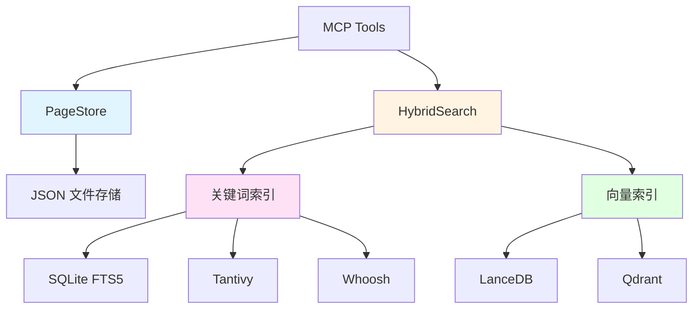
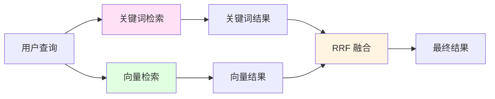
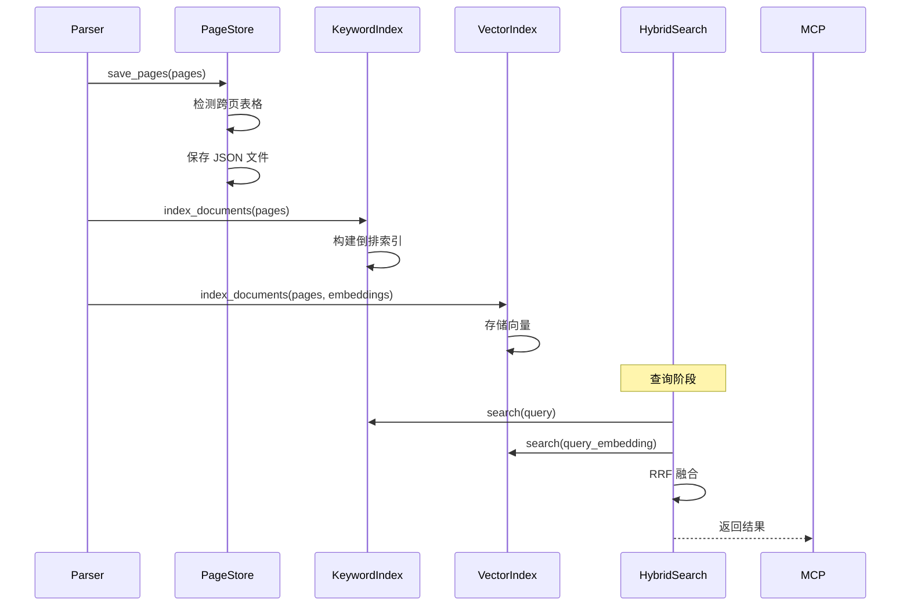

# RegReader 架构详解 - Part 5: Storage and Index Layer 详解

## 目录

- [1. Storage and Index Layer 概述](#1-storage-and-index-layer-概述)
- [2. PageStore - 页面存储](#2-pagestore---页面存储)
- [3. 核心数据模型](#3-核心数据模型)
- [4. HybridSearch - 混合检索](#4-hybridsearch---混合检索)
- [5. 可插拔索引架构](#5-可插拔索引架构)

---

## 1. Storage and Index Layer 概述

### 1.1 什么是 Storage and Index Layer？

**Storage and Index Layer（存储与索引层）** 是 RegReader 的数据持久化和检索基础。

**核心职责**：
- 📄 **页面存储**：以页为单位持久化文档
- 🔍 **混合检索**：关键词 + 语义双路召回
- 🔌 **可插拔架构**：支持多种索引后端
- 📊 **跨页表格**：自动检测和拼接跨页表格

### 1.2 架构设计



### 1.3 设计原则

| 原则 | 说明 | 实现 |
|------|------|------|
| **页面为单位** | 文档按页存储，不做任意切块 | PageDocument 模型 |
| **结构化存储** | 使用 Pydantic 模型保证类型安全 | BaseModel 继承 |
| **可插拔后端** | 索引后端可替换 | 抽象基类 + 工厂模式 |
| **RRF 融合** | 关键词和向量结果融合 | Reciprocal Rank Fusion |

---

## 2. PageStore - 页面存储

### 2.1 核心功能

**PageStore** 负责 PageDocument 的持久化存储和读取。

**关键特性**：
- ✅ **JSON 存储**：每页一个 JSON 文件
- ✅ **元数据管理**：目录、结构、表格注册表
- ✅ **跨页表格**：自动检测和拼接
- ✅ **批量操作**：支持页面范围读取

### 2.2 存储结构

```
data/storage/pages/
├── angui_2024/                    # 规程目录
│   ├── info.json                  # 规程信息
│   ├── toc.json                   # 目录树
│   ├── structure.json             # 文档结构
│   ├── table_registry.json        # 表格注册表
│   ├── page_0001.json             # 第1页
│   ├── page_0002.json             # 第2页
│   └── ...
└── wengui_2024/
    └── ...
```

**文件说明**：
- `info.json`: 规程元信息（标题、页数、索引时间）
- `toc.json`: 目录树结构（TocTree）
- `structure.json`: 完整章节树（DocumentStructure）
- `table_registry.json`: 表格索引（跨页表格映射）
- `page_XXXX.json`: 单页数据（PageDocument）

### 2.3 核心 API

#### 2.3.1 保存页面

```python
from regreader.storage.page_store import PageStore

store = PageStore()

# 保存页面列表
info = store.save_pages(
    pages=page_documents,
    toc=toc_tree,
    doc_structure=document_structure,
    source_file="angui_2024.pdf",
)
```

#### 2.3.2 加载页面

```python
# 加载单页
page = store.load_page(reg_id="angui_2024", page_num=45)

# 加载页面范围
pages = store.load_page_range(
    reg_id="angui_2024",
    start_page=45,
    end_page=47,
)

# 加载目录
toc = store.load_toc(reg_id="angui_2024")

# 加载文档结构
structure = store.load_structure(reg_id="angui_2024")
```

#### 2.3.3 表格操作

```python
# 保存表格注册表
store.save_table_registry(reg_id="angui_2024", registry=table_registry)

# 加载表格注册表
registry = store.load_table_registry(reg_id="angui_2024")

# 获取跨页表格的所有段
table_segments = store.get_cross_page_table(
    reg_id="angui_2024",
    master_table_id="table_6_2",
)
```

### 2.4 设计亮点

#### 2.4.1 跨页表格检测

```python
def _detect_cross_page_tables(self, pages: list[PageDocument]) -> TableRegistry:
    """检测跨页表格"""
    registry = TableRegistry(reg_id=pages[0].reg_id)

    for i, page in enumerate(pages):
        for block in page.content_blocks:
            if block.block_type != "table":
                continue

            table = block.table_meta
            if not table:
                continue

            # 检查是否跨页
            if table.is_truncated and i + 1 < len(pages):
                next_page = pages[i + 1]
                # 查找下一页的续表
                continuation = self._find_table_continuation(table, next_page)
                if continuation:
                    # 标记为跨页表格
                    registry.add_cross_page_table(table, continuation)
```

#### 2.4.2 表格拼接

```python
def merge_cross_page_table(
    self,
    segments: list[TableMeta],
) -> TableMeta:
    """拼接跨页表格"""
    if not segments:
        raise ValueError("No segments to merge")

    master = segments[0]
    merged = TableMeta(
        table_id=master.table_id,
        caption=master.caption,
        is_truncated=False,  # 拼接后不再截断
        col_headers=master.col_headers,
        row_count=sum(s.row_count for s in segments),
        col_count=master.col_count,
        cells=[],
    )

    # 合并单元格（调整行索引）
    row_offset = 0
    for segment in segments:
        for cell in segment.cells:
            merged.cells.append(TableCell(
                row=cell.row + row_offset,
                col=cell.col,
                content=cell.content,
                row_span=cell.row_span,
                col_span=cell.col_span,
            ))
        row_offset += segment.row_count

    return merged
```

---

## 3. 核心数据模型

### 3.1 PageDocument - 页面文档

```python
class PageDocument(BaseModel):
    """页面文档（存储单元）"""

    reg_id: str                          # 规程标识
    page_num: int                        # 页码
    content_blocks: list[ContentBlock]   # 内容块列表
    active_chapters: list[ActiveChapter] # 活跃章节
    annotations: list[Annotation]        # 页面注释
    metadata: dict[str, Any]             # 元数据
```

**示例**：
```json
{
  "reg_id": "angui_2024",
  "page_num": 45,
  "content_blocks": [
    {
      "block_id": "block_45_1",
      "block_type": "heading",
      "content": "6.2 母线失压处置",
      "chapter_path": ["第六章", "母线故障处置"]
    },
    {
      "block_id": "block_45_2",
      "block_type": "text",
      "content": "母线失压时应立即检查保护装置..."
    }
  ],
  "active_chapters": [
    {
      "node_id": "node_6_2",
      "section_number": "6.2",
      "title": "母线失压处置"
    }
  ]
}
```

### 3.2 ContentBlock - 内容块

```python
class ContentBlock(BaseModel):
    """内容块（页面的基本组成单元）"""

    block_id: str                        # 块唯一标识
    block_type: Literal["text", "table", "heading", "list", "section_content"]
    content: str                         # 文本内容或 Markdown
    chapter_path: list[str]              # 章节路径
    table_meta: TableMeta | None = None  # 表格元数据（仅 table 类型）
```

**五种块类型**：

| 类型 | 说明 | 示例 |
|------|------|------|
| `text` | 普通文本段落 | "母线失压时应立即..." |
| `table` | 表格（带 table_meta） | 母线失压处置流程表 |
| `heading` | 章节标题 | "6.2 母线失压处置" |
| `list` | 列表项 | "1. 检查保护装置\n2. ..." |
| `section_content` | 章节号后的直接内容 | 长段落说明文字 |

### 3.3 TableMeta - 表格元数据

```python
class TableMeta(BaseModel):
    """表格元数据"""

    table_id: str                        # 表格唯一标识
    caption: str | None                  # 表格标题
    is_truncated: bool                   # 是否跨页截断
    row_headers: list[str]               # 行标题
    col_headers: list[str]               # 列标题
    row_count: int                       # 行数
    col_count: int                       # 列数
    cells: list[TableCell]               # 单元格数据

    # 跨页表格字段
    master_table_id: str | None          # 主表格ID
    segment_index: int                   # 段落索引
```

**跨页表格示例**：
```python
# 第45页：表格首段
TableMeta(
    table_id="table_6_2_seg0",
    caption="表6-2 母线失压处置流程",
    is_truncated=True,
    master_table_id="table_6_2",
    segment_index=0,
    row_count=10,
)

# 第46页：表格续段
TableMeta(
    table_id="table_6_2_seg1",
    caption=None,
    is_truncated=True,
    master_table_id="table_6_2",
    segment_index=1,
    row_count=5,
)
```

### 3.4 ChapterNode - 章节节点

```python
class ChapterNode(BaseModel):
    """章节节点（文档结构树）"""

    node_id: str                         # 节点唯一标识
    section_number: str                  # 章节编号 "2.1.4.1.6"
    title: str                           # 章节标题
    level: int                           # 层级 1-6
    page_num: int                        # 首次出现页码

    # 层级关系
    parent_id: str | None                # 父节点ID
    children_ids: list[str]              # 子节点ID列表

    # 内容关联
    content_block_ids: list[str]         # 内容块ID列表
    has_direct_content: bool             # 是否有直接内容
    direct_content: str | None           # 直接内容
```

---

## 4. HybridSearch - 混合检索

### 4.1 核心功能

**HybridSearch** 实现关键词 + 语义的混合检索。

**关键特性**：
- ✅ **双路召回**：关键词索引 + 向量索引
- ✅ **RRF 融合**：Reciprocal Rank Fusion 算法
- ✅ **可插拔后端**：支持多种索引实现
- ✅ **权重调节**：可配置关键词/向量权重

### 4.2 检索流程



### 4.3 核心 API

```python
from regreader.index.hybrid_search import HybridSearch

# 初始化
search = HybridSearch(
    keyword_backend="fts5",      # fts5, tantivy, whoosh
    vector_backend="lancedb",    # lancedb, qdrant
    fts_weight=0.4,              # 关键词权重
    vector_weight=0.6,           # 向量权重
)

# 搜索
results = search.search(
    query="母线失压处理流程",
    reg_id="angui_2024",
    limit=10,
)

# 结果格式
for result in results:
    print(f"{result.score:.2f} - {result.source}")
    print(result.snippet)
```

### 4.4 RRF 融合算法

```python
def _merge_results(
    self,
    keyword_results: list[SearchResult],
    vector_results: list[SearchResult],
    limit: int,
) -> list[SearchResult]:
    """RRF 融合算法"""
    result_map: dict[tuple, SearchResult] = {}
    score_map: dict[tuple, float] = {}
    k = 60  # RRF 参数

    # 关键词结果
    for rank, result in enumerate(keyword_results):
        key = (result.reg_id, result.page_num, result.block_id)
        rrf_score = self.fts_weight / (k + rank + 1)
        if key not in result_map:
            result_map[key] = result
            score_map[key] = 0
        score_map[key] += rrf_score

    # 向量结果
    for rank, result in enumerate(vector_results):
        key = (result.reg_id, result.page_num, result.block_id)
        rrf_score = self.vector_weight / (k + rank + 1)
        if key not in result_map:
            result_map[key] = result
            score_map[key] = 0
        score_map[key] += rrf_score

    # 按分数排序
    sorted_keys = sorted(score_map.keys(), key=lambda k: score_map[k], reverse=True)
    return [result_map[k] for k in sorted_keys[:limit]]
```

**RRF 公式**：
```
RRF_score = Σ (weight / (k + rank + 1))

其中：
- weight: 索引权重（fts_weight 或 vector_weight）
- k: 常数（通常为 60）
- rank: 结果在该索引中的排名（从 0 开始）
```

---

## 5. 可插拔索引架构

### 5.1 抽象基类

**BaseKeywordIndex** - 关键词索引抽象：
```python
class BaseKeywordIndex(ABC):
    """关键词索引抽象基类"""

    @abstractmethod
    def index_documents(self, documents: list[PageDocument]) -> None:
        """索引文档"""
        pass

    @abstractmethod
    def search(self, query: str, reg_id: str, limit: int) -> list[SearchResult]:
        """搜索"""
        pass

    @abstractmethod
    def delete_regulation(self, reg_id: str) -> None:
        """删除规程索引"""
        pass
```

**BaseVectorIndex** - 向量索引抽象：
```python
class BaseVectorIndex(ABC):
    """向量索引抽象基类"""

    @abstractmethod
    def index_documents(
        self,
        documents: list[PageDocument],
        embeddings: list[list[float]],
    ) -> None:
        """索引文档（带向量）"""
        pass

    @abstractmethod
    def search(
        self,
        query_embedding: list[float],
        reg_id: str,
        limit: int,
    ) -> list[SearchResult]:
        """向量搜索"""
        pass
```

### 5.2 关键词索引实现

#### 5.2.1 FTS5Index（默认）

```python
class FTS5Index(BaseKeywordIndex):
    """SQLite FTS5 全文索引"""

    def __init__(self, db_path: Path):
        self.db_path = db_path
        self._init_db()

    def _init_db(self):
        """初始化 FTS5 表"""
        conn = sqlite3.connect(self.db_path)
        conn.execute("""
            CREATE VIRTUAL TABLE IF NOT EXISTS fts_index USING fts5(
                reg_id,
                page_num,
                block_id,
                content,
                chapter_path,
                tokenize='unicode61 remove_diacritics 2'
            )
        """)
        conn.commit()
        conn.close()

    def search(self, query: str, reg_id: str, limit: int) -> list[SearchResult]:
        """FTS5 搜索"""
        conn = sqlite3.connect(self.db_path)
        cursor = conn.execute("""
            SELECT reg_id, page_num, block_id, content, rank
            FROM fts_index
            WHERE reg_id = ? AND fts_index MATCH ?
            ORDER BY rank
            LIMIT ?
        """, (reg_id, query, limit))

        results = []
        for row in cursor:
            results.append(SearchResult(
                reg_id=row[0],
                page_num=row[1],
                block_id=row[2],
                snippet=row[3][:200],
                score=-row[4],  # FTS5 rank 是负数
                source=f"{row[0]} P{row[1]}",
            ))

        conn.close()
        return results
```

#### 5.2.2 TantivyIndex（可选）

```python
class TantivyIndex(BaseKeywordIndex):
    """Tantivy 全文索引（Rust 实现）"""

    def __init__(self, index_dir: Path):
        import tantivy
        self.index_dir = index_dir
        self.schema = self._build_schema()
        self.index = tantivy.Index(self.schema, str(index_dir))

    def search(self, query: str, reg_id: str, limit: int) -> list[SearchResult]:
        """Tantivy 搜索"""
        searcher = self.index.searcher()
        query_parser = tantivy.QueryParser.for_index(
            self.index,
            ["content", "chapter_path"],
        )

        parsed_query = query_parser.parse_query(f"reg_id:{reg_id} AND {query}")
        results = searcher.search(parsed_query, limit)

        return [self._convert_result(hit) for hit in results]
```

### 5.3 向量索引实现

#### 5.3.1 LanceDBIndex（默认）

```python
class LanceDBIndex(BaseVectorIndex):
    """LanceDB 向量索引（Arrow 列存）"""

    def __init__(self, db_path: Path):
        import lancedb
        self.db = lancedb.connect(str(db_path))

    def index_documents(
        self,
        documents: list[PageDocument],
        embeddings: list[list[float]],
    ) -> None:
        """索引文档"""
        data = []
        for doc, emb in zip(documents, embeddings):
            for block in doc.content_blocks:
                data.append({
                    "reg_id": doc.reg_id,
                    "page_num": doc.page_num,
                    "block_id": block.block_id,
                    "content": block.content,
                    "vector": emb,
                })

        table = self.db.create_table("vectors", data, mode="overwrite")

    def search(
        self,
        query_embedding: list[float],
        reg_id: str,
        limit: int,
    ) -> list[SearchResult]:
        """向量搜索"""
        table = self.db.open_table("vectors")
        results = table.search(query_embedding) \
            .where(f"reg_id = '{reg_id}'") \
            .limit(limit) \
            .to_list()

        return [self._convert_result(r) for r in results]
```

#### 5.3.2 QdrantIndex（可选）

```python
class QdrantIndex(BaseVectorIndex):
    """Qdrant 向量索引（专业向量数据库）"""

    def __init__(self, host: str, port: int):
        from qdrant_client import QdrantClient
        self.client = QdrantClient(host=host, port=port)
        self.collection_name = "regreader"

    def search(
        self,
        query_embedding: list[float],
        reg_id: str,
        limit: int,
    ) -> list[SearchResult]:
        """Qdrant 搜索"""
        results = self.client.search(
            collection_name=self.collection_name,
            query_vector=query_embedding,
            query_filter={
                "must": [{"key": "reg_id", "match": {"value": reg_id}}]
            },
            limit=limit,
        )

        return [self._convert_result(r) for r in results]
```

### 5.4 索引后端对比

| 后端 | 类型 | 优势 | 劣势 | 适用场景 |
|------|------|------|------|----------|
| **FTS5** | 关键词 | 内置、零依赖 | 中文分词弱 | 默认选择 |
| **Tantivy** | 关键词 | Rust 实现、快速 | 需要编译 | 大规模文档 |
| **Whoosh** | 关键词 | 纯 Python | 性能一般 | 简单场景 |
| **LanceDB** | 向量 | Arrow 列存、快速 | 内存占用高 | 默认选择 |
| **Qdrant** | 向量 | 专业向量库 | 需要独立部署 | 生产环境 |

### 5.5 工厂模式

```python
def create_keyword_index(backend: str, **kwargs) -> BaseKeywordIndex:
    """创建关键词索引"""
    if backend == "fts5":
        return FTS5Index(**kwargs)
    elif backend == "tantivy":
        return TantivyIndex(**kwargs)
    elif backend == "whoosh":
        return WhooshIndex(**kwargs)
    else:
        raise ValueError(f"Unknown keyword backend: {backend}")

def create_vector_index(backend: str, **kwargs) -> BaseVectorIndex:
    """创建向量索引"""
    if backend == "lancedb":
        return LanceDBIndex(**kwargs)
    elif backend == "qdrant":
        return QdrantIndex(**kwargs)
    else:
        raise ValueError(f"Unknown vector backend: {backend}")
```

---

## 6. Storage and Index Layer 总结

### 6.1 核心组件对比

| 组件 | 职责 | 核心特性 | 数据格式 |
|------|------|----------|----------|
| **PageStore** | 页面持久化 | JSON 存储、跨页表格 | PageDocument |
| **HybridSearch** | 混合检索 | RRF 融合、双路召回 | SearchResult |
| **KeywordIndex** | 关键词索引 | FTS5/Tantivy/Whoosh | 倒排索引 |
| **VectorIndex** | 向量索引 | LanceDB/Qdrant | 向量数据库 |

### 6.2 数据流



### 6.3 设计原则总结

| 原则 | 实现 | 收益 |
|------|------|------|
| **页面为单位** | PageDocument 模型 | 保留原始结构 |
| **结构化存储** | Pydantic BaseModel | 类型安全 |
| **可插拔后端** | 抽象基类 + 工厂 | 灵活替换 |
| **RRF 融合** | 双路召回 + 加权 | 提升召回率 |
| **跨页处理** | master_table_id | 完整表格 |

### 6.4 性能优化

**索引优化**：
- FTS5: 使用 `unicode61` tokenizer 支持中文
- LanceDB: Arrow 列存减少内存拷贝
- 批量索引: 减少 I/O 次数

**查询优化**：
- RRF 融合: 并行执行关键词和向量搜索
- 结果缓存: 相同查询复用结果
- 分页加载: 按需加载页面内容

---

**下一部分**：[Part 6: Integration Patterns 详解](#) - 完整数据流示例和集成模式

