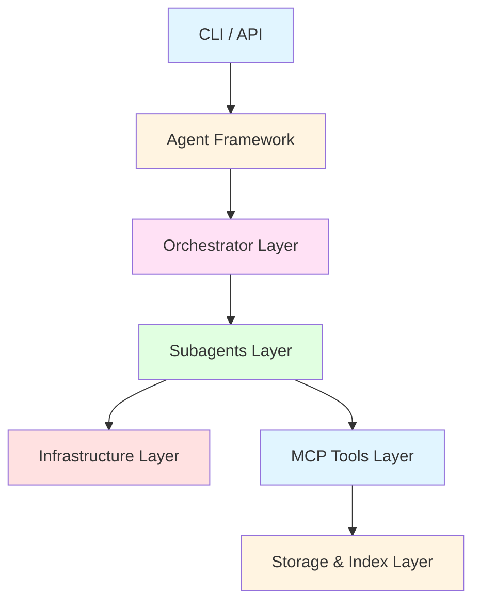
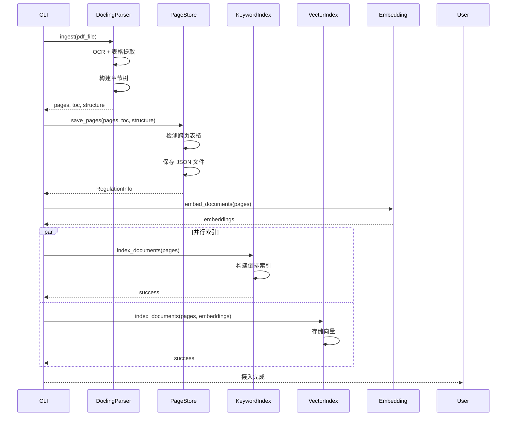
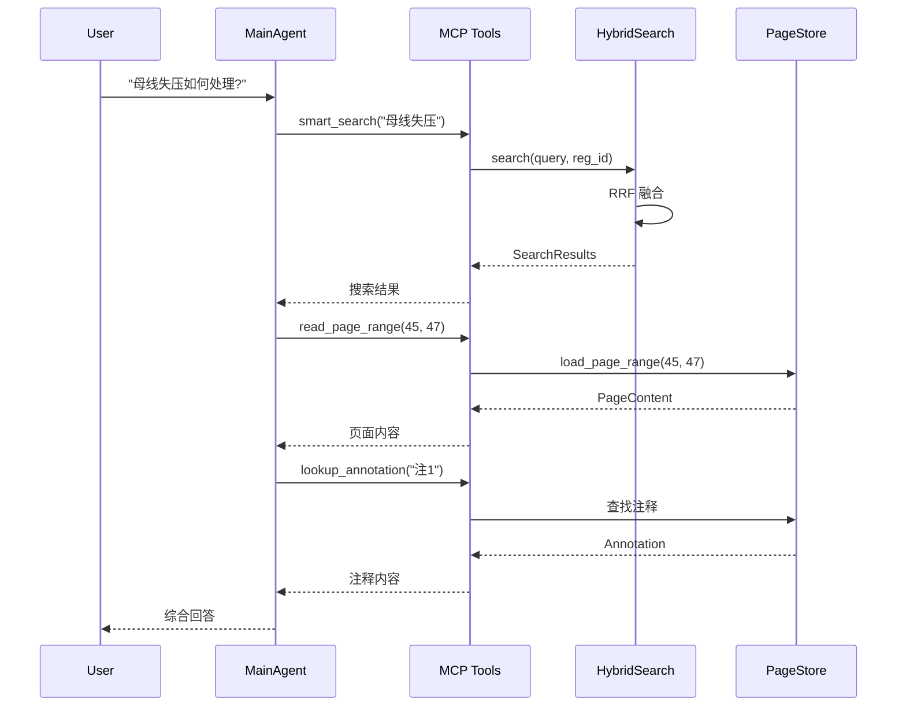
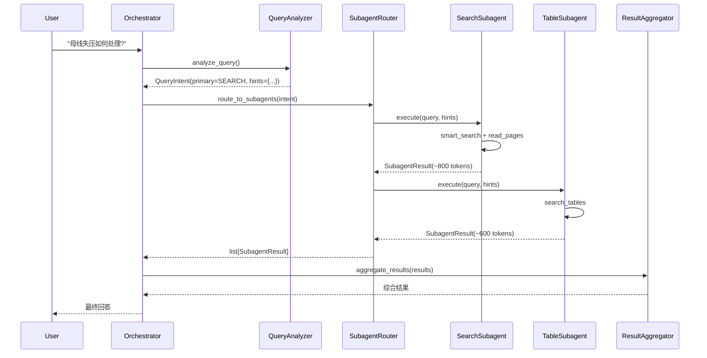
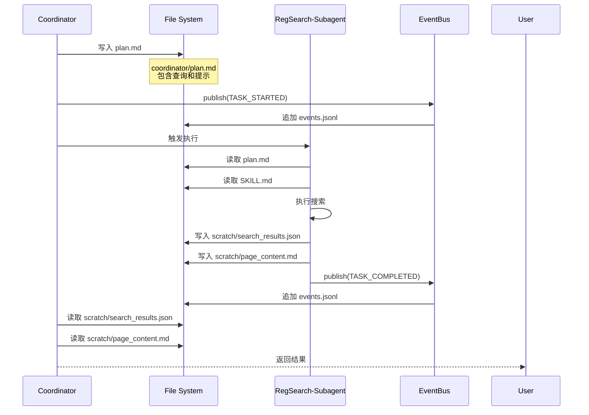
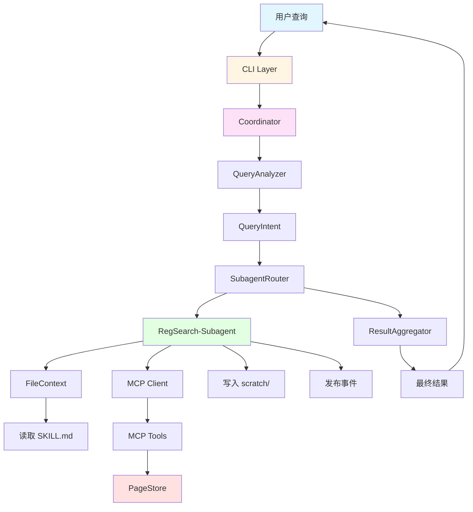
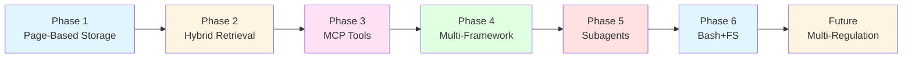

# RegReader 架构详解 - Part 6: Integration Patterns 详解

## 目录

- [1. Integration Patterns 概述](#1-integration-patterns-概述)
- [2. 文档摄入流程](#2-文档摄入流程)
- [3. 查询处理流程](#3-查询处理流程)
- [4. Orchestrator 模式](#4-orchestrator-模式)
- [5. Bash+FS 模式](#5-bashfs-模式)
- [6. 端到端示例](#6-端到端示例)

---

## 1. Integration Patterns 概述

### 1.1 什么是 Integration Patterns？

**Integration Patterns（集成模式）** 展示 RegReader 各层如何协同工作，完成端到端的任务。

**核心模式**：
- 📥 **文档摄入模式**：PDF → Parser → PageStore → Index
- 🔍 **查询处理模式**：Query → Orchestrator → MCP Tools → Results
- 🤖 **Orchestrator 模式**：上下文隔离的多 Subagent 协作
- 📁 **Bash+FS 模式**：文件系统作为通信媒介

### 1.2 架构层级回顾



---

## 2. 文档摄入流程

### 2.1 完整流程图



### 2.2 代码示例

```python
from regreader.parser.docling_parser import DoclingParser
from regreader.storage.page_store import PageStore
from regreader.index.hybrid_search import HybridSearch
from regreader.embedding.sentence_transformer import SentenceTransformerEmbedding

# 1. 解析文档
parser = DoclingParser()
result = parser.parse_pdf("angui_2024.pdf")

pages = result.pages
toc = result.toc
structure = result.structure

# 2. 保存页面
store = PageStore()
info = store.save_pages(
    pages=pages,
    toc=toc,
    doc_structure=structure,
    source_file="angui_2024.pdf",
)

print(f"保存完成: {info.reg_id}, {info.total_pages} 页")

# 3. 生成向量
embedding = SentenceTransformerEmbedding()
texts = [block.content for page in pages for block in page.content_blocks]
embeddings = embedding.embed_documents(texts)

# 4. 构建索引
search = HybridSearch(
    keyword_backend="fts5",
    vector_backend="lancedb",
)

# 并行索引
import asyncio

async def index_all():
    await asyncio.gather(
        search.keyword_index.index_documents(pages),
        search.vector_index.index_documents(pages, embeddings),
    )

asyncio.run(index_all())
print("索引构建完成")
```

### 2.3 关键步骤详解

#### 2.3.1 Docling 解析

```python
# Docling 解析配置
parser = DoclingParser(
    ocr_enabled=True,              # 启用 OCR
    table_structure_enabled=True,  # 表格结构提取
    extract_images=False,          # 不提取图片
)

# 解析结果
result = parser.parse_pdf("document.pdf")

# 输出
result.pages          # list[PageDocument]
result.toc            # TocTree
result.structure      # DocumentStructure
result.table_registry # TableRegistry
```

#### 2.3.2 跨页表格检测

```python
# PageStore 自动检测跨页表格
def _detect_cross_page_tables(self, pages: list[PageDocument]) -> TableRegistry:
    registry = TableRegistry(reg_id=pages[0].reg_id)

    for i, page in enumerate(pages):
        for block in page.content_blocks:
            if block.block_type != "table":
                continue

            table = block.table_meta
            if table.is_truncated and i + 1 < len(pages):
                # 查找下一页的续表
                next_page = pages[i + 1]
                continuation = self._find_table_continuation(table, next_page)
                if continuation:
                    registry.add_cross_page_table(
                        master_id=f"table_{i}",
                        segments=[table, continuation],
                    )

    return registry
```

---

## 3. 查询处理流程

### 3.1 标准模式（无 Orchestrator）



**特点**：
- ✅ 简单直接
- ❌ 上下文膨胀（~4000 tokens）
- ❌ 工具调用顺序由 LLM 决定

### 3.2 Orchestrator 模式（上下文隔离）



**特点**：
- ✅ 上下文隔离（每个 Subagent ~800 tokens）
- ✅ 并行执行（Search + Table 同时运行）
- ✅ 结果聚合（去重 + 合并）
- ⚠️ 需要额外的 Orchestrator 层

### 3.3 上下文对比

| 模式 | MainAgent 上下文 | Subagent 上下文 | 总 Token 消耗 |
|------|------------------|-----------------|---------------|
| 标准模式 | ~4000 tokens | N/A | ~4000 |
| Orchestrator 模式 | ~1000 tokens | ~800 × 2 | ~2600 |

**节省比例**：~35% token 消耗减少

---

## 4. Orchestrator 模式

### 4.1 三种框架实现

RegReader 支持三种 Agent 框架，每种框架有不同的 Orchestrator 实现模式：

#### 4.1.1 Claude SDK - Handoff Pattern

```python
from anthropic import Anthropic

# 1. 创建 Orchestrator Agent
orchestrator = client.messages.create(
    model="claude-sonnet-4-20250514",
    max_tokens=4096,
    tools=[
        {
            "type": "agent",
            "name": "search_subagent",
            "description": "搜索和导航文档内容",
        },
        {
            "type": "agent",
            "name": "table_subagent",
            "description": "搜索和提取表格数据",
        },
    ],
    messages=[{"role": "user", "content": query}],
)

# 2. Orchestrator 决定 Handoff
if orchestrator.stop_reason == "tool_use":
    tool_call = orchestrator.content[0]
    if tool_call.name == "search_subagent":
        # 切换到 SearchSubagent
        result = search_subagent.run(query, hints)
```

**特点**：
- 🔄 **Agent Handoff**：Orchestrator 将控制权交给 Subagent
- 📦 **嵌套 Agent**：Subagent 是独立的 Agent 实例
- 🎯 **显式切换**：通过 `tool_use` 触发 Subagent

#### 4.1.2 Pydantic AI - Delegation Pattern

```python
from pydantic_ai import Agent

# 1. 定义 Orchestrator Agent
orchestrator = Agent(
    model="openai:gpt-4",
    system_prompt="你是查询协调器，负责分析查询并委托给专业 Subagent",
)

# 2. 注册 Subagent 工具
@orchestrator.tool
async def delegate_to_search(query: str, hints: dict) -> str:
    """委托给搜索 Subagent"""
    search_agent = Agent(model="openai:gpt-4", tools=search_tools)
    result = await search_agent.run(query, deps={"hints": hints})
    return result.data

@orchestrator.tool
async def delegate_to_table(query: str, hints: dict) -> str:
    """委托给表格 Subagent"""
    table_agent = Agent(model="openai:gpt-4", tools=table_tools)
    result = await table_agent.run(query, deps={"hints": hints})
    return result.data

# 3. Orchestrator 调用工具
result = await orchestrator.run(user_query)
```

**特点**：
- 🛠️ **Tool Delegation**：Subagent 作为 Orchestrator 的工具
- 🔗 **函数调用**：通过 `@tool` 装饰器注册
- 🎭 **透明切换**：LLM 自动选择合适的工具

#### 4.1.3 LangGraph - Subgraph Pattern

```python
from langgraph.graph import StateGraph, END

# 1. 定义 Orchestrator Graph
orchestrator_graph = StateGraph(OrchestratorState)

# 2. 添加 Subagent 节点
orchestrator_graph.add_node("analyze", analyze_query_node)
orchestrator_graph.add_node("search_subagent", search_subagent_graph)
orchestrator_graph.add_node("table_subagent", table_subagent_graph)
orchestrator_graph.add_node("aggregate", aggregate_results_node)

# 3. 定义路由逻辑
def route_to_subagents(state: OrchestratorState) -> list[str]:
    intent = state["query_intent"]
    if intent.primary_type == SubagentType.SEARCH:
        return ["search_subagent"]
    elif intent.primary_type == SubagentType.TABLE:
        return ["table_subagent"]
    else:
        return ["search_subagent", "table_subagent"]

orchestrator_graph.add_conditional_edges(
    "analyze",
    route_to_subagents,
)

# 4. 编译并运行
app = orchestrator_graph.compile()
result = await app.ainvoke({"query": user_query})
```

**特点**：
- 🌳 **Subgraph 嵌套**：Subagent 是独立的子图
- 🔀 **显式路由**：通过条件边控制流程
- 📊 **状态传递**：通过 State 对象共享上下文

### 4.2 框架对比

| 特性 | Claude SDK | Pydantic AI | LangGraph |
|------|-----------|-------------|-----------|
| **模式** | Handoff | Delegation | Subgraph |
| **Subagent 类型** | 独立 Agent | 工具函数 | 子图节点 |
| **控制流** | 显式切换 | 透明调用 | 条件路由 |
| **状态管理** | 消息历史 | 依赖注入 | State 对象 |
| **并行执行** | ❌ 顺序 | ✅ 支持 | ✅ 支持 |
| **可视化** | ❌ 无 | ❌ 无 | ✅ Mermaid |
| **学习曲线** | 低 | 中 | 高 |
| **适用场景** | 简单任务 | 中等复杂度 | 复杂工作流 |

### 4.3 QueryAnalyzer 实现

```python
from dataclasses import dataclass
from regreader.subagents.config import SubagentType

@dataclass
class QueryIntent:
    """查询意图分析结果"""
    primary_type: SubagentType
    secondary_types: list[SubagentType]
    confidence: float
    hints: dict[str, Any]
    requires_multi_hop: bool

class QueryAnalyzer:
    """查询意图分析器"""

    async def analyze(self, query: str, reg_id: str | None) -> QueryIntent:
        """分析查询意图"""
        hints = self._extract_hints(query)

        # 判断主要 Subagent 类型
        if self._is_table_query(query, hints):
            primary = SubagentType.TABLE
        elif self._is_reference_query(query, hints):
            primary = SubagentType.REFERENCE
        else:
            primary = SubagentType.SEARCH

        # 判断是否需要多跳
        requires_multi_hop = self._check_multi_hop(query, hints)

        return QueryIntent(
            primary_type=primary,
            secondary_types=self._get_secondary_types(primary, hints),
            confidence=0.85,
            hints=hints,
            requires_multi_hop=requires_multi_hop,
        )

    def _extract_hints(self, query: str) -> dict[str, Any]:
        """提取查询提示"""
        hints = {}

        # 章节范围
        if match := re.search(r"第([一二三四五六七八九十]+)章", query):
            hints["chapter_scope"] = match.group(0)

        # 表格提示
        if "表" in query or "表格" in query:
            hints["table_hint"] = True

        # 注释提示
        if match := re.search(r"注\s*(\d+)", query):
            hints["annotation_hint"] = match.group(0)

        # 引用文本
        if match := re.search(r"见(.{2,20})", query):
            hints["reference_text"] = match.group(1)

        return hints
```

---

## 5. Bash+FS 模式

### 5.1 什么是 Bash+FS 模式？

**Bash+FS（Bash + File System）模式** 是 RegReader 的创新架构模式，使用文件系统作为 Agent 之间的通信媒介。

**核心思想**：
- 📁 **文件作为消息**：Agent 通过读写文件交换信息
- 🔒 **目录隔离**：每个 Subagent 有独立的工作目录
- 📝 **JSONL 日志**：事件和审计日志以 JSONL 格式持久化
- 🎯 **技能系统**：通过 `SKILL.md` 定义可复用的工作流

### 5.2 目录结构

```
regreader/
├── coordinator/                    # Coordinator 工作区
│   ├── CLAUDE.md                   # 项目入口点
│   ├── plan.md                     # 任务规划（运行时生成）
│   ├── session_state.json          # 会话状态
│   └── logs/
│       ├── events.jsonl            # 事件日志
│       └── audit.jsonl             # 审计日志
│
├── subagents/                      # Subagent 工作区
│   ├── regsearch/                  # RegSearch-Subagent
│   │   ├── SKILL.md                # 技能文档
│   │   ├── scratch/                # 临时结果
│   │   │   ├── search_results.json
│   │   │   └── page_content.md
│   │   └── logs/
│   │       └── execution.jsonl
│   └── ...
│
├── shared/                         # 共享只读资源
│   ├── data/ -> data/storage/      # 符号链接到存储
│   ├── docs/                       # 工具使用指南
│   └── templates/                  # 输出模板
│
└── skills/                         # 技能注册表
    ├── registry.yaml               # 技能注册表
    ├── simple_search/
    │   ├── SKILL.md
    │   └── entry.py
    └── ...
```

### 5.3 文件通信流程



### 5.4 FileContext 使用示例

```python
from regreader.infrastructure.file_context import FileContext

# 1. 创建 FileContext
ctx = FileContext(
    workspace_root=Path("subagents/regsearch"),
    subagent_id="regsearch",
    allowed_read_dirs=["shared/data", "shared/docs"],
    allowed_write_dirs=["scratch", "logs"],
)

# 2. 读取技能文档
skill_content = ctx.read_skill("SKILL.md")

# 3. 读取共享资源
tool_guide = ctx.read_shared("docs/tool_guide.md")

# 4. 写入临时结果
ctx.write_scratch("search_results.json", json.dumps(results))

# 5. 记录日志
ctx.log("执行搜索完成", level="INFO", metadata={"count": len(results)})

# 6. 读取临时结果
results_json = ctx.read_scratch("search_results.json")
results = json.loads(results_json)
```

### 5.5 EventBus 事件系统

```python
from regreader.infrastructure.event_bus import EventBus, SubagentEvent

# 1. 创建 EventBus
event_bus = EventBus(log_file=Path("coordinator/logs/events.jsonl"))

# 2. 发布事件
event_bus.publish(
    event_type=SubagentEvent.TASK_STARTED,
    subagent_id="regsearch",
    payload={
        "query": "母线失压如何处理?",
        "reg_id": "angui_2024",
        "hints": {"chapter_scope": "第六章"},
    },
)

# 3. 订阅事件
def on_task_completed(event):
    print(f"任务完成: {event.subagent_id}")
    print(f"结果: {event.payload['result']}")

event_bus.subscribe(SubagentEvent.TASK_COMPLETED, on_task_completed)

# 4. 回放事件（用于恢复会话）
events = event_bus.replay_events(
    event_types=[SubagentEvent.TASK_STARTED, SubagentEvent.TASK_COMPLETED],
    subagent_id="regsearch",
)
```

**支持的事件类型**：
- `TASK_STARTED` / `TASK_COMPLETED` / `TASK_FAILED`
- `HANDOFF_REQUEST` / `HANDOFF_ACCEPTED` / `HANDOFF_REJECTED`
- `TOOL_CALL_STARTED` / `TOOL_CALL_COMPLETED` / `TOOL_CALL_FAILED`
- `CONTEXT_UPDATED` / `RESULT_AGGREGATED`
- `SESSION_STARTED` / `SESSION_ENDED`
- `ERROR_OCCURRED`

### 5.6 技能系统

**技能（Skill）** 是可复用的工作流定义，通过 `SKILL.md` 文件描述。

#### 5.6.1 SKILL.md 格式

```markdown
---
name: simple_search
description: 简单的文档搜索工作流
entry_point: skills/simple_search/entry.py
required_tools:
  - smart_search
  - read_page_range
subagents:
  - regsearch
---

# Simple Search Skill

## 工作流程

1. 使用 `smart_search` 搜索相关内容
2. 使用 `read_page_range` 读取页面详情
3. 返回综合结果

## 使用示例

```bash
regreader skill run simple_search --query "母线失压" --reg-id angui_2024
```
```

#### 5.6.2 SkillLoader 使用

```python
from regreader.infrastructure.skill_loader import SkillLoader

# 1. 加载所有技能
loader = SkillLoader(
    skills_dir=Path("skills"),
    registry_file=Path("skills/registry.yaml"),
)
skills = loader.load_all()

# 2. 获取特定技能
skill = loader.get_skill("simple_search")
print(f"技能: {skill.name}")
print(f"描述: {skill.description}")
print(f"入口: {skill.entry_point}")

# 3. 获取 Subagent 的技能
regsearch_skills = loader.get_skills_for_subagent("regsearch")
```

### 5.7 SecurityGuard 安全控制

```python
from regreader.infrastructure.security_guard import SecurityGuard

# 1. 创建 SecurityGuard
guard = SecurityGuard(
    workspace_root=Path("subagents/regsearch"),
    subagent_id="regsearch",
    audit_log_file=Path("coordinator/logs/audit.jsonl"),
)

# 2. 检查文件访问权限
try:
    guard.check_file_access(
        path=Path("scratch/results.json"),
        operation="write",
    )
    # 允许写入
except PermissionError as e:
    print(f"权限拒绝: {e}")

# 3. 检查工具访问权限
try:
    guard.check_tool_access(
        tool_name="smart_search",
        subagent_id="regsearch",
    )
    # 允许调用
except PermissionError as e:
    print(f"工具拒绝: {e}")

# 4. 审计日志
guard.audit_log(
    action="file_write",
    target="scratch/results.json",
    result="success",
    metadata={"size": 1024},
)
```

**安全层级**：
1. **目录隔离**：Subagent 只能访问自己的工作目录
2. **工具白名单**：每个 Subagent 只能调用预定义的工具
3. **审计日志**：所有操作记录到 JSONL 文件

---

## 6. 端到端示例

### 6.1 完整查询流程（Orchestrator + Bash+FS）

**用户查询**：`"母线失压如何处理？请查看第六章相关内容"`

#### Step 1: CLI 接收查询

```python
# cli.py
@app.command()
def chat(
    reg_id: str,
    agent: str = "pydantic",
    orchestrator: bool = False,
):
    """交互式对话"""
    if orchestrator:
        # 使用 Orchestrator 模式
        orch = PydanticOrchestrator(
            reg_id=reg_id,
            uses_file_system=True,  # 启用 Bash+FS
        )
        result = await orch.process_query(query)
    else:
        # 标准模式
        agent = MainAgent(reg_id=reg_id)
        result = await agent.run(query)
```

#### Step 2: Coordinator 分析查询

```python
# orchestrator/coordinator.py
async def process_query(self, query: str) -> str:
    # 1. 记录查询
    await self.log_query(query, hints={}, reg_id=self.reg_id)

    # 2. 分析意图
    intent = await self.analyzer.analyze(query, self.reg_id)
    # QueryIntent(
    #     primary_type=SubagentType.SEARCH,
    #     hints={"chapter_scope": "第六章"},
    #     requires_multi_hop=False,
    # )

    # 3. 路由到 Subagent
    results = await self.router.route(intent, query, self.reg_id)

    # 4. 聚合结果
    final_result = await self.aggregator.aggregate(results)

    return final_result
```

#### Step 3: RegSearch-Subagent 执行

```python
# subagents/regsearch/base.py
async def execute(self, context: SubagentContext) -> SubagentResult:
    # 1. 读取技能文档
    skill_content = self.file_ctx.read_skill("SKILL.md")

    # 2. 调用 MCP 工具
    search_results = await self.mcp_client.call_tool(
        "smart_search",
        query=context.query,
        reg_id=context.reg_id,
        chapter_scope=context.hints.get("chapter_scope"),
    )

    # 3. 写入临时结果
    self.file_ctx.write_scratch(
        "search_results.json",
        json.dumps(search_results),
    )

    # 4. 读取页面内容
    page_content = await self.mcp_client.call_tool(
        "read_page_range",
        reg_id=context.reg_id,
        start_page=search_results[0]["page_num"],
        end_page=search_results[0]["page_num"] + 2,
    )

    # 5. 写入页面内容
    self.file_ctx.write_scratch("page_content.md", page_content)

    # 6. 发布事件
    self.event_bus.publish(
        event_type=SubagentEvent.TASK_COMPLETED,
        subagent_id="regsearch",
        payload={"result": "success"},
    )

    return SubagentResult(
        content=page_content,
        sources=[f"angui_2024:p{r['page_num']}" for r in search_results],
        tool_calls=[...],
        metadata={"search_count": len(search_results)},
    )
```

#### Step 4: 文件系统状态

执行后的文件系统状态：

```
coordinator/
├── plan.md                          # 查询计划
│   内容: "母线失压如何处理？请查看第六章相关内容"
│   提示: {"chapter_scope": "第六章"}
│
├── session_state.json               # 会话状态
│   {
│     "session_id": "session_20260118_143022",
│     "query_count": 1,
│     "current_reg_id": "angui_2024"
│   }
│
└── logs/
    └── events.jsonl                 # 事件日志
        {"event_type": "TASK_STARTED", "subagent_id": "regsearch", ...}
        {"event_type": "TASK_COMPLETED", "subagent_id": "regsearch", ...}

subagents/regsearch/
├── scratch/
│   ├── search_results.json          # 搜索结果
│   │   [{"page_num": 45, "score": 0.92, ...}, ...]
│   │
│   └── page_content.md              # 页面内容
│       # 第六章 母线失压处理
│       ## 6.1 故障判断
│       ...
│
└── logs/
    └── execution.jsonl              # 执行日志
        {"action": "tool_call", "tool": "smart_search", ...}
        {"action": "tool_call", "tool": "read_page_range", ...}
```

#### Step 5: ResultAggregator 聚合结果

```python
# orchestrator/aggregator.py
async def aggregate(self, results: list[SubagentResult]) -> str:
    # 1. 合并内容
    combined_content = "\n\n".join([r.content for r in results])

    # 2. 去重来源
    all_sources = []
    for result in results:
        all_sources.extend(result.sources)
    unique_sources = list(set(all_sources))

    # 3. 生成最终回答
    final_answer = f"""
{combined_content}

**来源**：
{', '.join(unique_sources)}

**工具调用统计**：
- 搜索次数: {sum(len(r.tool_calls) for r in results)}
- 页面读取: {sum(r.metadata.get('search_count', 0) for r in results)}
"""

    return final_answer
```

#### Step 6: 返回给用户

```
母线失压处理流程：

1. 故障判断标准
   - 母线电压低于额定电压的 80%
   - 持续时间超过 2 秒
   - 相关保护装置动作

2. 应急处理步骤
   - 立即切断非重要负荷
   - 检查备用电源状态
   - 启动应急预案

3. 恢复操作流程
   - 确认故障原因已排除
   - 逐步恢复负荷供电
   - 记录故障处理过程

**来源**：angui_2024:p45, angui_2024:p46, angui_2024:p47

**工具调用统计**：
- 搜索次数: 2
- 页面读取: 3
```

### 6.2 数据流图



### 6.3 关键优势总结

| 特性 | 标准模式 | Orchestrator + Bash+FS |
|------|---------|------------------------|
| **上下文大小** | ~4000 tokens | ~800 tokens/subagent |
| **Token 消耗** | 高 | 节省 ~35% |
| **并行执行** | ❌ | ✅ |
| **状态持久化** | 内存 | 文件系统 |
| **可恢复性** | ❌ | ✅ (通过 events.jsonl) |
| **安全隔离** | ❌ | ✅ (目录 + 工具白名单) |
| **可审计性** | ❌ | ✅ (audit.jsonl) |
| **技能复用** | ❌ | ✅ (SKILL.md) |

---

## 7. 总结

### 7.1 Integration Patterns 核心价值

RegReader 的 Integration Patterns 展示了如何将 7 层架构有机整合，实现高效的文档检索系统：

1. **文档摄入流程**
   - Docling 解析 → PageStore 存储 → HybridSearch 索引
   - 自动检测跨页表格，构建完整的文档结构

2. **查询处理流程**
   - 标准模式：简单直接，但上下文膨胀
   - Orchestrator 模式：上下文隔离，节省 ~35% token

3. **Orchestrator 模式**
   - Claude SDK: Handoff Pattern（显式切换）
   - Pydantic AI: Delegation Pattern（透明调用）
   - LangGraph: Subgraph Pattern（条件路由）

4. **Bash+FS 模式**
   - 文件作为消息：Agent 通过文件系统通信
   - 目录隔离：每个 Subagent 独立工作区
   - 事件驱动：EventBus 实现松耦合
   - 技能系统：SKILL.md 定义可复用工作流

### 7.2 架构演进路径



### 7.3 最佳实践建议

**何时使用标准模式**：
- ✅ 简单查询（单次搜索即可回答）
- ✅ 快速原型开发
- ✅ 调试和测试

**何时使用 Orchestrator 模式**：
- ✅ 复杂查询（需要多步推理）
- ✅ 需要并行执行多个 Subagent
- ✅ 关注 token 成本优化

**何时使用 Bash+FS 模式**：
- ✅ 需要状态持久化和会话恢复
- ✅ 需要安全隔离和审计日志
- ✅ 需要技能复用和工作流编排
- ✅ 生产环境部署

### 7.4 下一步

完成 Part 6 后，接下来将创建：

**Part 7: Visual Diagrams**
- 完整系统架构图
- 各层交互序列图
- 数据流和控制流图
- 部署架构图

---

**文档版本**：v1.0
**创建日期**：2026-01-18
**作者**：RegReader 开发团队
