# RegReader 架构详解 - Part 7: Visual Diagrams

## 目录

- [1. 完整系统架构图](#1-完整系统架构图)
- [2. 层级交互序列图](#2-层级交互序列图)
- [3. 数据流图](#3-数据流图)
- [4. 控制流图](#4-控制流图)
- [5. 部署架构图](#5-部署架构图)
- [6. 组件关系图](#6-组件关系图)

---

## 1. 完整系统架构图

### 1.1 7 层架构全景图

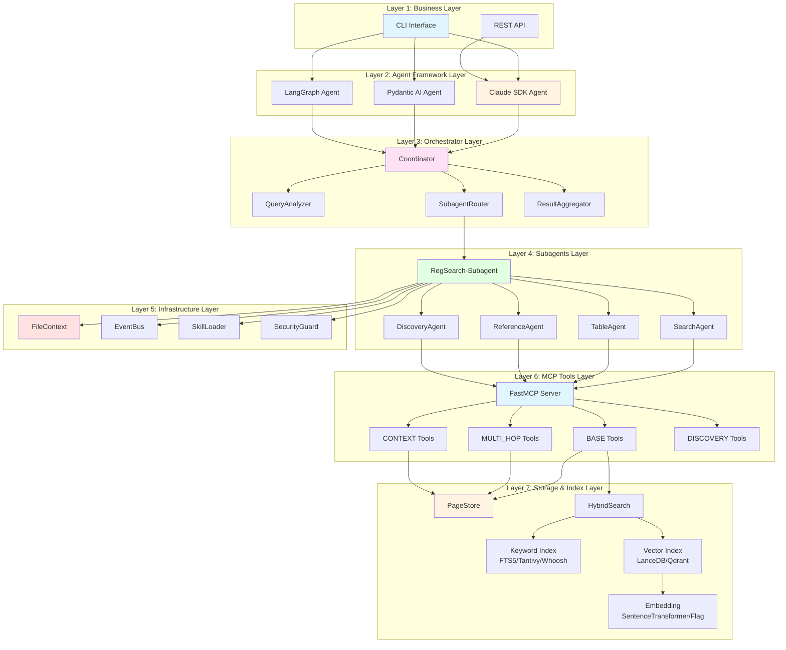

### 1.2 层级职责说明

| 层级 | 职责 | 核心组件 |
|------|------|----------|
| **Layer 1: Business** | 用户接口，接收查询请求 | CLI, REST API |
| **Layer 2: Agent Framework** | Agent 实现，支持三种框架 | Claude SDK, Pydantic AI, LangGraph |
| **Layer 3: Orchestrator** | 查询协调，意图分析，结果聚合 | Coordinator, Analyzer, Router, Aggregator |
| **Layer 4: Subagents** | 领域专家，执行具体任务 | RegSearch, Search/Table/Reference/Discovery |
| **Layer 5: Infrastructure** | 基础设施，文件管理，事件总线 | FileContext, EventBus, SkillLoader, SecurityGuard |
| **Layer 6: MCP Tools** | 工具层，16+ MCP 工具 | BASE, MULTI_HOP, CONTEXT, DISCOVERY |
| **Layer 7: Storage & Index** | 存储和索引，页面数据管理 | PageStore, HybridSearch, FTS5/LanceDB |

---

## 2. 层级交互序列图

### 2.1 标准查询流程（无 Orchestrator）

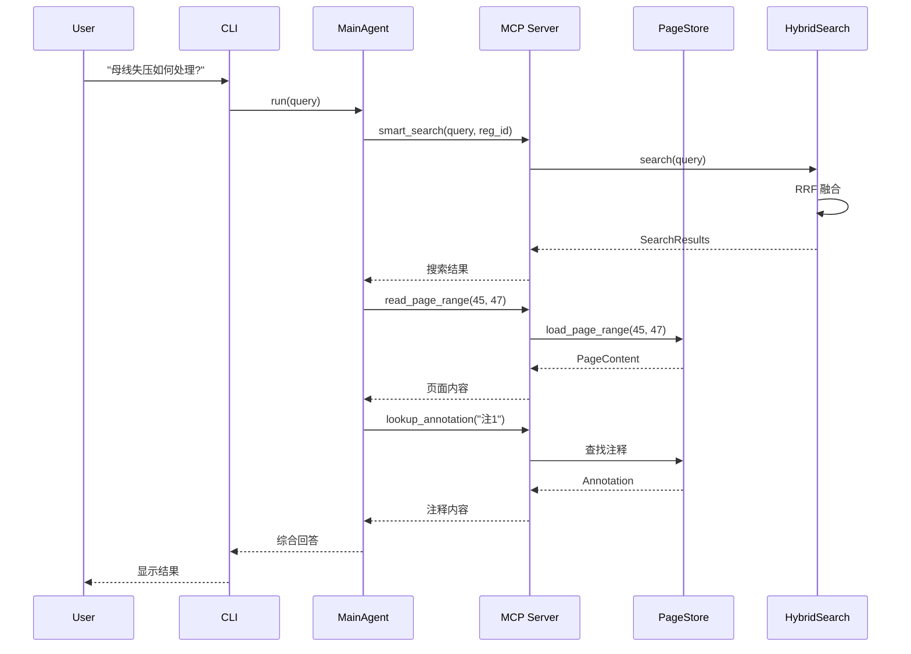

### 2.2 Orchestrator 查询流程（上下文隔离）

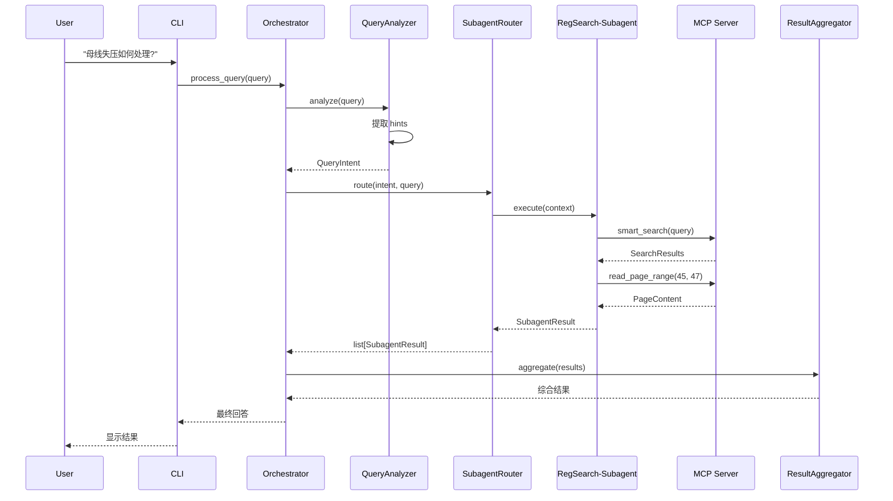

### 2.3 Bash+FS 模式流程（文件通信）

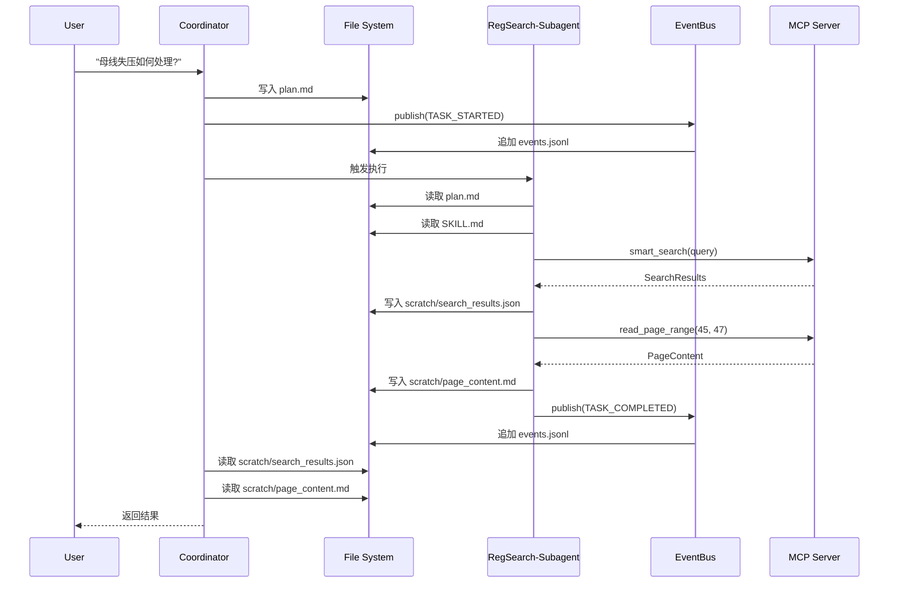

---

## 3. 数据流图

### 3.1 文档摄入数据流

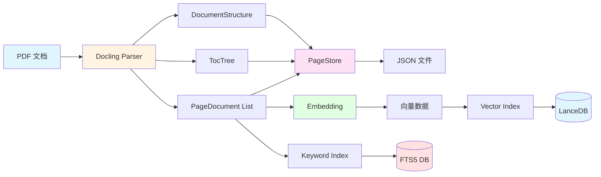

### 3.2 查询处理数据流

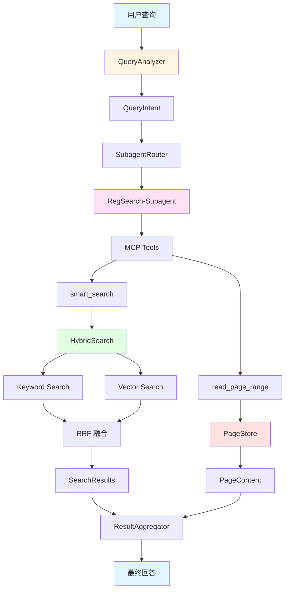

---

## 4. 控制流图

### 4.1 Orchestrator 控制流

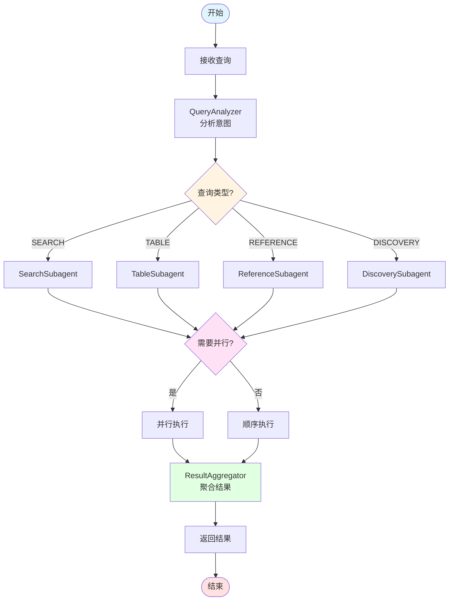

### 4.2 Bash+FS 事件流

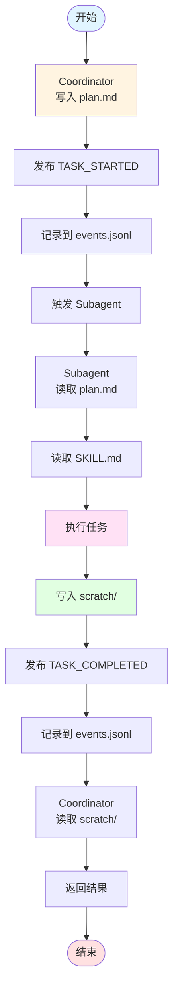

---

## 5. 部署架构图

### 5.1 单机部署架构

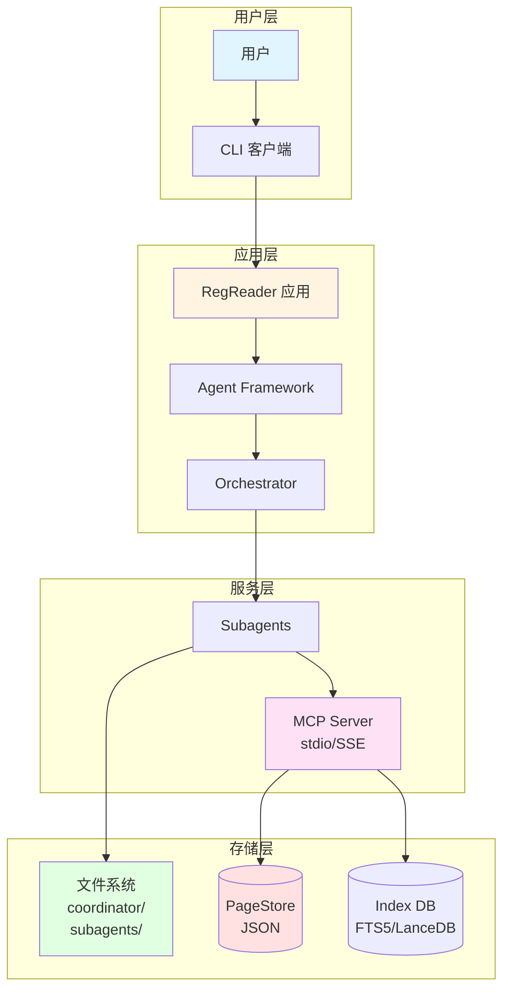

### 5.2 分布式部署架构（未来）

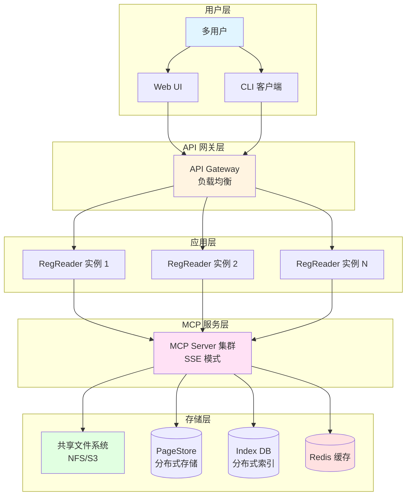

---

## 6. 组件关系图

### 6.1 Infrastructure 层组件关系

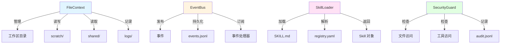

### 6.2 Subagents 层组件关系

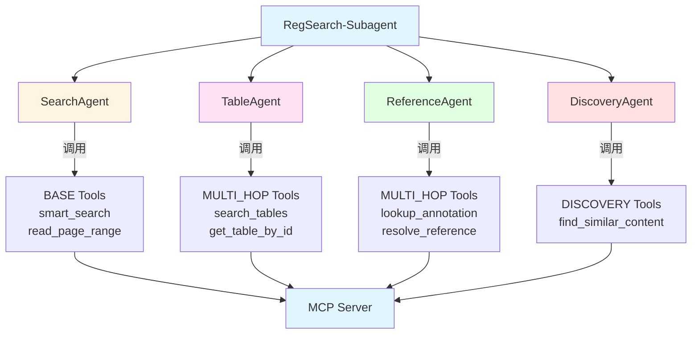

### 6.3 Storage 层组件关系

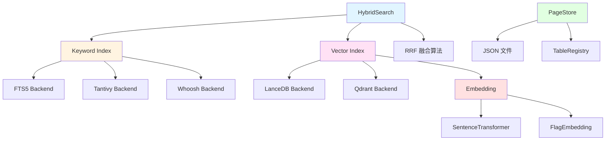

---

## 7. 总结

### 7.1 Visual Diagrams 核心价值

Part 7 通过可视化图表展示了 RegReader 架构的各个方面：

1. **完整系统架构图**
   - 7 层架构全景图
   - 层级职责说明

2. **层级交互序列图**
   - 标准查询流程
   - Orchestrator 查询流程
   - Bash+FS 模式流程

3. **数据流图**
   - 文档摄入数据流
   - 查询处理数据流

4. **控制流图**
   - Orchestrator 控制流
   - Bash+FS 事件流

5. **部署架构图**
   - 单机部署架构
   - 分布式部署架构（未来）

6. **组件关系图**
   - Infrastructure 层组件关系
   - Subagents 层组件关系
   - Storage 层组件关系

### 7.2 图表使用指南

**架构设计阶段**：
- 使用完整系统架构图理解整体结构
- 使用层级职责说明表了解各层职责

**开发实现阶段**：
- 使用层级交互序列图理解调用流程
- 使用组件关系图理解模块依赖

**问题排查阶段**：
- 使用数据流图追踪数据传递
- 使用控制流图理解执行路径

**部署运维阶段**：
- 使用部署架构图规划部署方案
- 使用分布式架构图设计扩展方案

### 7.3 架构文档完整性

至此，RegReader 架构详解的 7 个部分已全部完成：

| Part | 标题 | 核心内容 |
|------|------|----------|
| **Part 1** | Architecture Overview | 设计哲学、7 层架构、核心创新 |
| **Part 2** | Orchestrator Layer | BaseOrchestrator、Coordinator、QueryAnalyzer |
| **Part 3** | MCP Tools Layer | 16+ 工具、4 个阶段、工具分类 |
| **Part 4** | Infrastructure Layer | FileContext、EventBus、SkillLoader、SecurityGuard |
| **Part 5** | Storage & Index Layer | PageStore、HybridSearch、插件化索引 |
| **Part 6** | Integration Patterns | 摄入流程、查询流程、Bash+FS 模式 |
| **Part 7** | Visual Diagrams | 架构图、序列图、数据流图、部署图 |

### 7.4 后续阅读建议

**新手入门**：
1. Part 1: Architecture Overview（理解整体设计）
2. Part 7: Visual Diagrams（通过图表快速理解）
3. Part 6: Integration Patterns（了解端到端流程）

**深入学习**：
1. Part 3: MCP Tools Layer（理解工具设计）
2. Part 5: Storage & Index Layer（理解存储架构）
3. Part 2: Orchestrator Layer（理解协调机制）

**高级主题**：
1. Part 4: Infrastructure Layer（理解 Bash+FS 范式）
2. Part 6: Integration Patterns（理解三种框架实现）

---

**文档版本**：v1.0
**创建日期**：2026-01-18
**作者**：RegReader 开发团队

**相关文档**：
- [Part 1: Architecture Overview](./ARCHITECTURE_EXPLANATION_PART1.md)
- [Part 2: Orchestrator Layer](./ARCHITECTURE_EXPLANATION_PART2.md)
- [Part 3: MCP Tools Layer](./ARCHITECTURE_EXPLANATION_PART3.md)
- [Part 4: Infrastructure Layer](./ARCHITECTURE_EXPLANATION_PART4.md)
- [Part 5: Storage & Index Layer](./ARCHITECTURE_EXPLANATION_PART5.md)
- [Part 6: Integration Patterns](./ARCHITECTURE_EXPLANATION_PART6.md)
